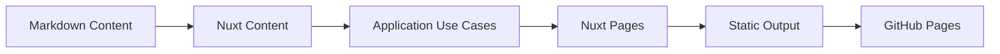

# Rofik Engineering Portfolio

Production-style engineering portfolio and knowledge platform built with Nuxt, Nuxt Content, Tailwind CSS, and static generation for GitHub Pages.

This repository is intentionally more than a visual portfolio. It documents how I design systems: architecture decisions, high-level designs, low-level designs, system design case studies, engineering patterns, observability, performance, security, and real project breakdowns.

## Purpose

The site answers one question:

Can this engineer design, document, and communicate production software systems?

It includes:

- Project pages with architecture, API design, database schema, caching, messaging, deployment, monitoring, performance, and lessons learned.
- Case studies for real projects such as Lakhimpur Agri Business, TikTok Clone, and IMGENGINE.
- Architecture documentation with HLD, LLD, ADRs, C4-style diagrams, sequence diagrams, and tradeoff analysis.
- System design documents for Instagram Feed, URL Shortener, Realtime Chat, and Notification Service.
- Engineering articles covering repository pattern, Redis, Kafka, JWT, Docker networking, PostgreSQL scaling, CQRS, observability, and Lighthouse performance.

## Tech Stack

- Nuxt 4
- Vue 3
- Nuxt Content
- Tailwind CSS
- TypeScript
- Vitest
- GitHub Pages static hosting

## Architecture



The project follows a clean, documentation-first structure:

- `src/content` stores projects, case studies, architecture, and documentation.
- `src/domain` defines domain types and repository contracts.
- `src/application` contains use cases.
- `src/infrastructure` adapts Nuxt Content into application repositories.
- `src/presentation` contains UI components, layouts, and composables.
- `src/pages` defines static routes.

## Commands

```bash
pnpm install
pnpm dev
pnpm test
pnpm typecheck
pnpm generate
```

## Deployment

Static generation emits the deployable site to `.output/public`.

For GitHub Pages under `Rofikali/Portfolio-Rofik`, generate with:

```bash
NUXT_APP_BASE_URL=/Portfolio-Rofik/ pnpm generate
```

## Quality Gates

Before deployment:

```bash
pnpm test
pnpm typecheck
NUXT_APP_BASE_URL=/Portfolio-Rofik/ pnpm generate
```

Target Lighthouse scores:

- Performance: 95+
- Accessibility: 95+
- SEO: 100
- Best Practices: 100

## Content Standards

Every serious project page should include:

- Hero
- Overview
- Architecture
- Screenshots
- API design
- Database schema
- Caching
- Messaging
- Monitoring
- Deployment
- Performance
- Lessons learned
- GitHub link

Every architecture document should include:

- Requirements
- Constraints
- Architecture goals
- Diagrams
- Tradeoffs
- Scaling strategy
- Security
- Future improvements
- Lessons learned

## Status

Version `0.1` is ready for static deployment after the quality gates pass. The site is designed to evolve as a living engineering handbook.
