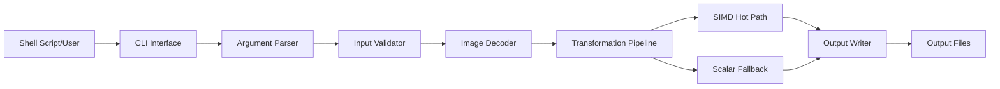
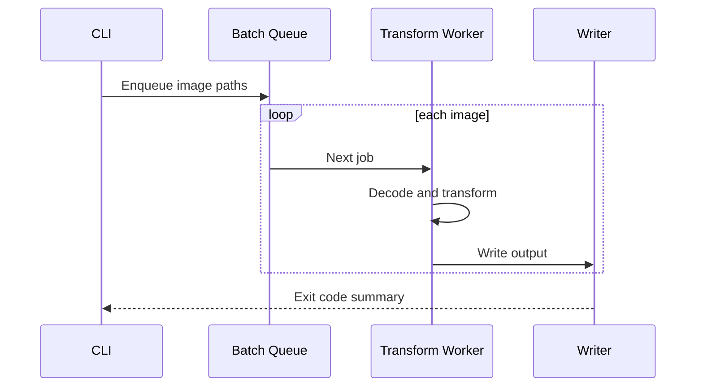
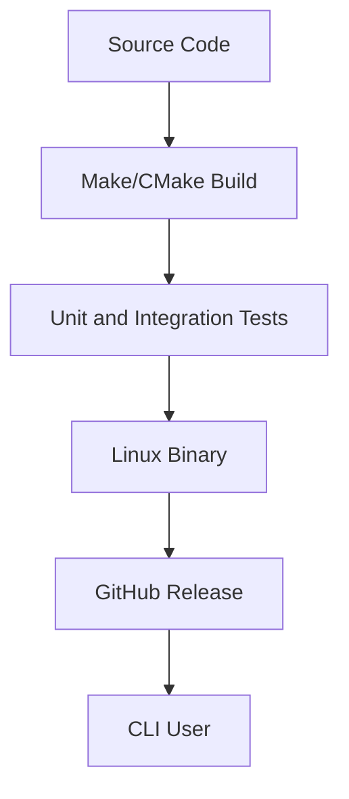

# Executive Summary

IMGENGINE is a high-performance image processing CLI written in C. It focuses on predictable memory usage, batch workflows, Linux-first execution, and CPU-aware optimization.

The project demonstrates engineering skills that are different from web application development: memory ownership, buffer layout, command design, profiling, error handling, and performance tradeoffs.

# Problem

Image processing tools can become slow or memory-heavy when each transformation allocates new buffers, copies data repeatedly, or hides expensive operations behind broad abstractions.

For a CLI, the problem is broader than raw speed. The tool must also be scriptable, deterministic, debuggable, and safe to run in batch jobs.

# Business Requirements

- Accept image input from local file paths.
- Apply transformations through predictable CLI flags.
- Write output files with clear success and failure states.
- Support batch processing.
- Keep memory usage bounded.
- Make performance measurable through profiling.

# Architecture

The CLI boundary is intentionally boring. Performance complexity stays inside the engine, not inside user-facing command behavior.

# Challenges

- Keeping manual memory ownership readable.
- Avoiding premature SIMD optimization.
- Designing useful error messages in C.
- Keeping the transformation pipeline testable.
- Making optimized routines optional instead of required everywhere.

# Database

IMGENGINE does not need a relational database. The persistence boundary is the filesystem.

Important filesystem rules:

- Never overwrite output unless explicitly requested.
- Fail fast when input paths are invalid.
- Keep temporary files isolated.
- Return non-zero exit codes for script automation.

# Caching

The project does not use Redis. Caching is CPU and memory oriented:

- Reuse allocated buffers when processing batches.
- Keep hot pixel data contiguous.
- Avoid unnecessary decode-transform-encode loops.
- Prefer streaming or tiled processing for large images.

# Queue

Batch mode can be modeled as a local work queue:

In a future server version, this same model could move to Kafka, SQS, or Redis streams.

# Monitoring

For a CLI, observability is local and explicit:

- `--verbose` mode for operation-level logs.
- Timing output for decode, transform, and write phases.
- Exit codes for automation.
- Optional benchmark mode for profiling.
- Memory checks with tools such as Valgrind or sanitizers.

# Deployment

The release artifact should include the binary, usage examples, supported formats, and benchmark notes.

# Performance

Performance targets:

- Avoid unbounded memory growth during batch jobs.
- Keep allocations outside inner loops.
- Use SIMD only on measured hot paths.
- Keep scalar fallback correct and easy to test.
- Report benchmark numbers with image size and CPU details.

Optimization approach:

1. Build a correct scalar implementation.
2. Add profiling around decode, transform, and write.
3. Optimize memory layout and allocation behavior.
4. Add SIMD only where profiling proves value.
5. Compare output correctness across scalar and SIMD paths.

# Lessons Learned

- Memory layout often matters before algorithm cleverness.
- Manual memory management needs naming discipline and ownership rules.
- SIMD is a tool, not an architecture.
- Script-friendly CLI behavior is a product feature.
- Profiling is the only honest way to decide what to optimize.

# Future Improvements

- Add benchmark reports to the README.
- Add fuzz testing for image inputs.
- Add sanitizer builds to CI.
- Add worker-threaded batch processing.
- Add cross-platform build notes.
