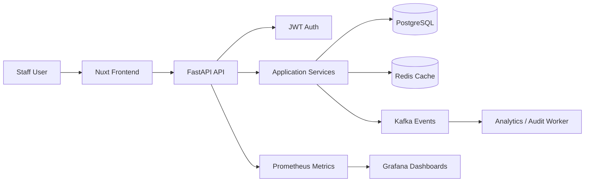
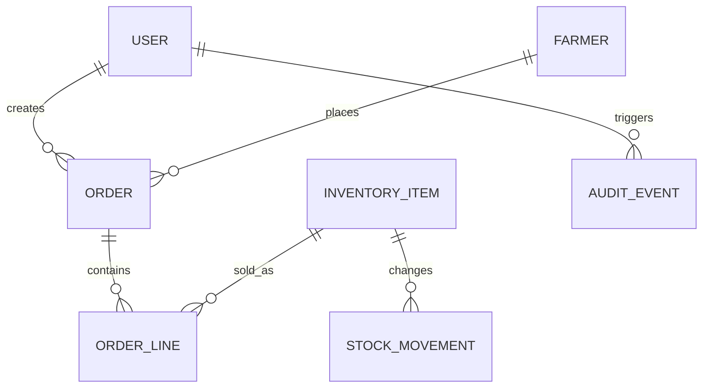
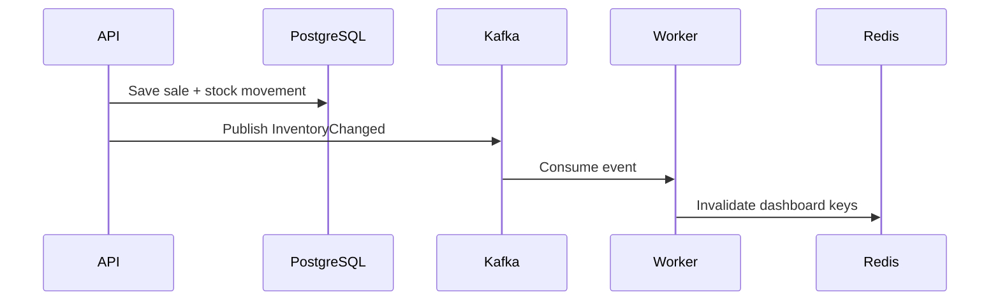
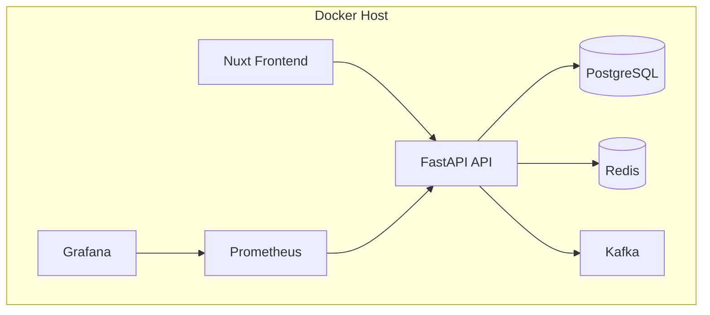

# Executive Summary

Lakhimpur Agri-Business is a full-stack platform for agricultural inventory, farmer management, sales workflows, analytics, and operational reporting.

The engineering focus is not only the UI. The case study demonstrates how the system should be modeled, deployed, monitored, cached, and evolved as a production backend platform.

# Problem

Agricultural businesses often rely on spreadsheets, notebooks, disconnected point-of-sale tools, and manual reports. This creates operational problems:

- Stock levels become inaccurate.
- Farmer records are duplicated or incomplete.
- Sales reporting is delayed.
- Managers cannot see business health in real time.
- Data quality depends on manual discipline instead of system constraints.

The technical challenge is to design a platform that supports daily business operations while staying simple enough to build, deploy, and maintain.

# Business Requirements

- Manage farmer/customer profiles.
- Track inventory items, quantities, categories, and stock movements.
- Record sales and orders.
- Generate dashboard analytics.
- Support authenticated staff users.
- Maintain audit-friendly history for important changes.
- Provide operational visibility through metrics and dashboards.

# Architecture

The architecture uses a clear split:

- Nuxt handles presentation and frontend routing.
- FastAPI owns API contracts and backend workflows.
- PostgreSQL is the system of record.
- Redis accelerates hot reads and dashboard summaries.
- Kafka decouples transactional writes from analytics/audit workflows.
- Prometheus and Grafana expose operational health.

# Challenges

## Domain Modeling

Inventory is not just a number on a product row. It changes through business events:

- Purchases.
- Sales.
- Adjustments.
- Returns.
- Damaged stock.

The design should model stock movement history instead of only storing the latest quantity.

## Caching Without Lying

Dashboard summaries are cacheable, but inventory correctness is not optional.

Redis should cache derived views, not become the source of truth.

## Async Workflows

Analytics and audit trails should not slow down core write requests. Kafka is used to publish business events after important operations.

## Deployment Reality

The system needs local reproducibility through Docker because it includes multiple services: frontend, API, database, cache, event broker, metrics, and dashboards.

# Database

Core entities:

- User
- Farmer
- InventoryItem
- StockMovement
- Order
- OrderLine
- Payment
- AuditEvent

Suggested ER model:

Important constraints:

- Inventory item SKU should be unique.
- Order status should be constrained to known states.
- Stock movement quantity should never be zero.
- Foreign keys should protect order and inventory consistency.

# Caching

Redis candidates:

- Dashboard totals.
- Top-selling products.
- Low-stock product lists.
- Frequently accessed reference data.

Cache invalidation strategy:

- Inventory mutation publishes an event.
- Worker recomputes or invalidates affected dashboard keys.
- API falls back to PostgreSQL on cache miss.

# Queue

Kafka events:

- `InventoryChanged`
- `OrderCreated`
- `PaymentRecorded`
- `FarmerUpdated`
- `AuditEventCreated`

Kafka is not used because it is fashionable. It is used where async event flow protects the core request path from analytics and audit work.

# Monitoring

Prometheus metrics:

- HTTP request count.
- HTTP request duration.
- Error rate by route.
- Database query latency.
- Redis cache hit ratio.
- Kafka consumer lag.
- Background worker failures.

Grafana dashboard panels:

- API p95 latency.
- Requests per second.
- 4xx/5xx error rate.
- Redis hit/miss ratio.
- PostgreSQL active connections.
- Kafka lag by topic.
- Worker success/failure rate.

# Deployment

Deployment goals:

- One-command local startup.
- Environment variables documented.
- Database migrations repeatable.
- Metrics available before production traffic.
- Logs structured enough for debugging.

# Performance

Performance targets:

- API p95 latency under 300 ms for common reads.
- Dashboard loads from Redis where safe.
- Inventory mutations stay transactional and consistent.
- Frontend routes remain static or pre-rendered where possible.

Optimizations:

- Index high-cardinality filters.
- Cache dashboard summaries.
- Paginate table endpoints.
- Avoid loading analytics on initial critical path.
- Compress and resize project images.

# Lessons Learned

- Business workflows should be modeled as domain events, not scattered conditionals.
- PostgreSQL constraints are part of the application design.
- Redis should accelerate reads, not hide weak data modeling.
- Kafka is valuable when it represents real business facts.
- Observability belongs in the first architecture draft.

# Future Improvements

- Add role-based authorization.
- Add audit event viewer.
- Add OpenAPI screenshots.
- Add migration examples.
- Add Grafana dashboard screenshots.
- Add load-test results.
- Add deployment environment diagram for production hosting.
