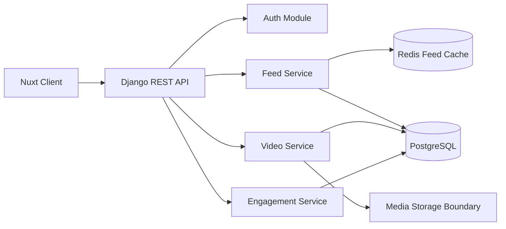
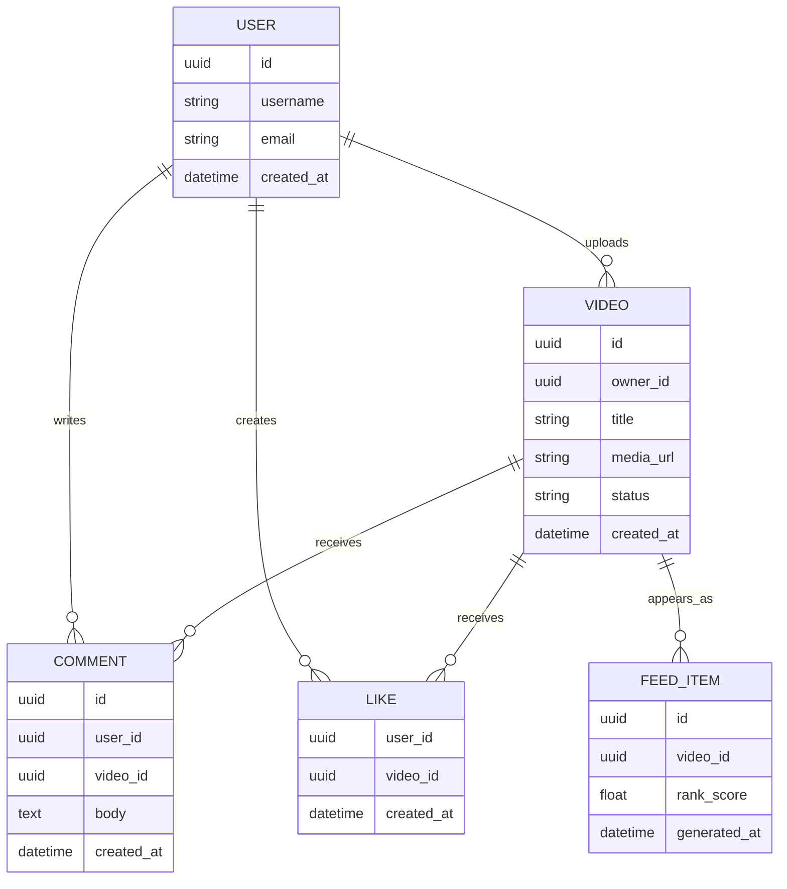
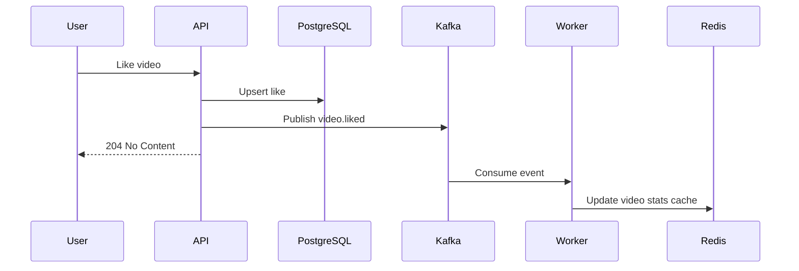
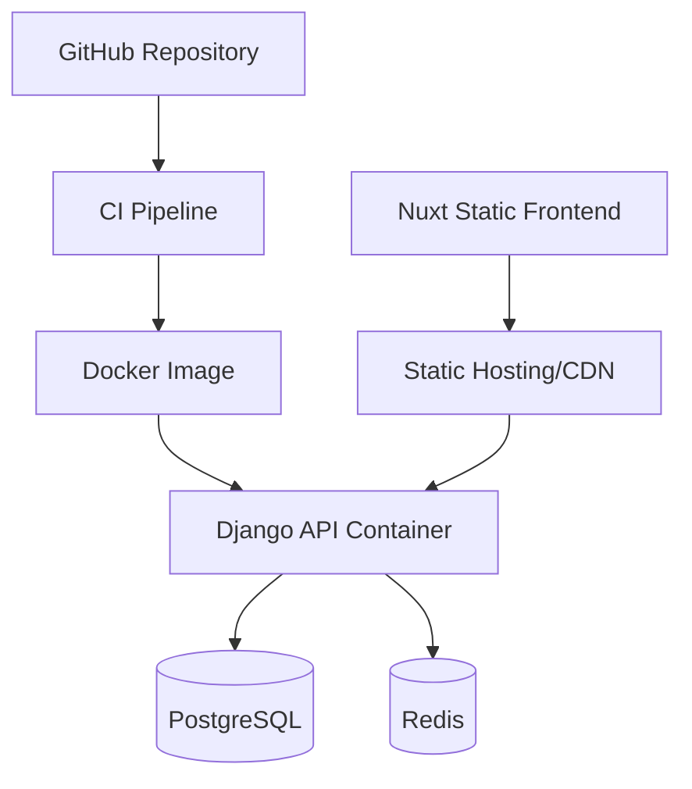

# Executive Summary

TikTok Clone is a short-form video platform case study. The project is designed around feed delivery, video metadata, creator profiles, comments, likes, and API-driven frontend integration.

The important engineering lesson is that social products are not only CRUD applications. The read path and write path have different needs. Feed reads must be fast and predictable, while uploads, comments, likes, and profile updates must preserve consistency and auditability.

# Problem

The product needs to show a personalized video feed, accept engagement events, and keep user-facing state fresh without forcing every request to rebuild the feed from raw relational tables.

Naive design problems:

- Feed endpoints scan too much data.
- Likes and comments become coupled to video retrieval.
- Video metadata and media storage boundaries are unclear.
- Cache invalidation is added after performance problems appear.
- The frontend depends on database-shaped responses instead of product-shaped APIs.

# Business Requirements

- Users can authenticate and browse a continuous video feed.
- Users can view creator profiles and video detail pages.
- Users can like and comment on videos.
- The frontend receives stable, versionable API responses.
- The system can add ranking and recommendation logic later.
- The system should be deployable through Docker for repeatable local and hosted environments.

# Architecture



The architecture keeps feed assembly separate from engagement writes. The first version can be implemented in a Django monolith, but the module boundaries are chosen so feed, video, and engagement logic can be extracted later if load demands it.

# Challenges

- Designing a feed without prematurely building a recommendation platform.
- Keeping comments and likes consistent without slowing every feed request.
- Separating media storage from relational metadata.
- Keeping API responses frontend-friendly and not table-shaped.
- Avoiding cache keys that are impossible to invalidate safely.

# Database



Important indexes:

- `videos(owner_id, created_at desc)`
- `comments(video_id, created_at desc)`
- `likes(video_id)`
- `likes(user_id, video_id)` unique
- `feed_items(rank_score desc, generated_at desc)`

# API Design

```http
POST /api/auth/login
GET  /api/feed?cursor=...
GET  /api/videos/{video_id}
POST /api/videos
POST /api/videos/{video_id}/likes
DELETE /api/videos/{video_id}/likes
GET  /api/videos/{video_id}/comments
POST /api/videos/{video_id}/comments
GET  /api/users/{username}
```

Feed response:

```json
{
  "items": [
    {
      "id": "video_123",
      "title": "Harvest workflow",
      "creator": {
        "username": "rofik"
      },
      "mediaUrl": "https://media.example/videos/video_123.mp4",
      "likeCount": 150,
      "commentCount": 18,
      "viewerHasLiked": false
    }
  ],
  "nextCursor": "rank_1700000000"
}
```

# Caching

Redis is used for read-heavy feed and aggregate metadata.

Cache keys:

- `feed:global:{cursor}` for global feed pages.
- `feed:user:{user_id}:{cursor}` for personalized feed slices.
- `video:stats:{video_id}` for like and comment counts.
- `profile:{username}` for creator profile summaries.

Invalidation rules:

- New upload invalidates the global first-page feed.
- Like/comment writes update counters directly or invalidate `video:stats`.
- Profile edits invalidate `profile:{username}`.
- Deleted videos remove video metadata and feed references.

# Queue

A production version would use Kafka or a managed queue for asynchronous engagement events.



# Monitoring

Important production metrics:

- Feed p95 latency.
- Feed cache hit ratio.
- Comment creation error rate.
- Like write conflict rate.
- Database query duration by endpoint.
- Redis memory usage.
- Media upload failures.

# Deployment



# Performance

Performance targets:

- Feed p95 under 300 ms for cached pages.
- Feed p95 under 700 ms for uncached pages.
- Comment write p95 under 250 ms.
- Like/unlike p95 under 150 ms.
- Cache hit ratio above 80 percent for first-page feed.

Techniques:

- Cursor pagination instead of offset pagination.
- Precomputed counters for likes and comments.
- Indexed foreign keys for engagement tables.
- Lightweight feed DTOs instead of full nested models.
- CDN or object storage for media delivery.

# Lessons Learned

- A feed is a read model, not just a query.
- Engagement writes should not block feed delivery.
- Media metadata belongs in PostgreSQL; media bytes belong behind a storage boundary.
- Cache invalidation must be designed with product events.
- Django can work well for social products when module boundaries are intentional.

# Future Improvements

- Add recommendation ranking with event history.
- Move media processing to a worker.
- Add moderation workflow for videos and comments.
- Add tracing with OpenTelemetry.
- Add Kafka-backed analytics events.
