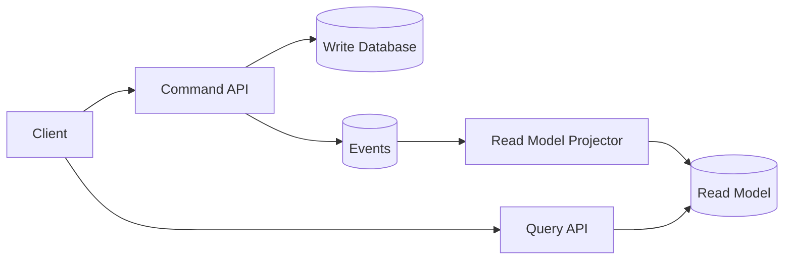

# Problem

Many systems use the same model for writes and reads. That works until the read experience needs denormalized, fast, product-shaped data while the write side needs validation, transactions, and invariants.

CQRS separates command models from query models.

# Without CQRS

One model handles:

- Validation.
- Persistence.
- Read formatting.
- Aggregation.
- UI response shape.

This becomes hard to change because read optimization can damage write correctness.

# Architecture

# Write Model

The write model protects invariants:

- Can this user perform the action?
- Is the state transition valid?
- Should this command be rejected?
- What event or state change should be persisted?

# Read Model

The read model serves user experience:

- Feed cards.
- Dashboard summaries.
- Search results.
- Notification inboxes.
- Aggregated metrics.

# Example

For an Instagram-like feed:

- Write model stores follows, posts, likes, comments.
- Events publish `post.created`, `user.followed`, `post.liked`.
- Read model stores precomputed feed items.
- Query API returns a fast feed response.

# Pros

- Read paths can be optimized independently.
- Write logic stays focused on correctness.
- Teams can evolve product views faster.
- Event streams improve auditability.

# Cons

- More moving parts.
- Eventual consistency.
- More testing complexity.
- Debugging requires event visibility.

# When Not To Use

- Simple CRUD applications.
- Small apps with low read complexity.
- Teams without monitoring for async pipelines.
- Workflows requiring immediate consistency everywhere.

# Monitoring

Track:

- Projection lag.
- Failed events.
- Read-model freshness.
- Command rejection rate.
- Query latency.

# Summary

CQRS is useful when read complexity and write correctness pull the model in different directions. It should be introduced for clear pressure, not architectural fashion.
