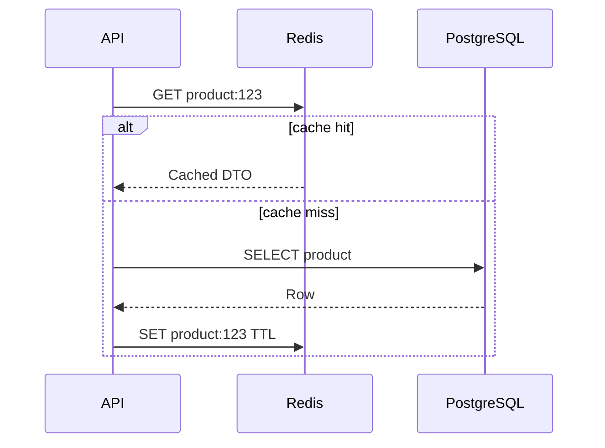
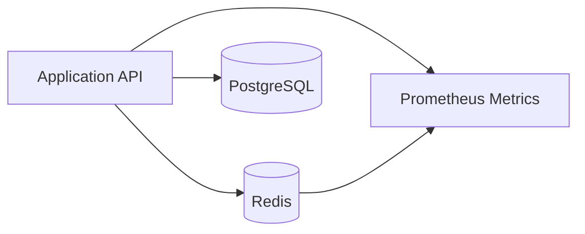

# Problem

Redis is often added after an application becomes slow. That usually creates fragile keys, unclear invalidation, and hidden consistency bugs.

Production Redis design starts with a question: what exact read, write, or coordination problem should Redis solve?

# Core Patterns

## Cache-Aside

The application checks Redis first. On miss, it loads from PostgreSQL and stores the result.

Best for read-heavy data that can tolerate short-lived staleness.

## Write-Through

The application writes to the database and updates Redis in the same flow.

Use this when cached data must be warm immediately after writes.

## Rate Limiting

Token bucket keys protect expensive endpoints:

- `rate:user:{user_id}:login`
- `rate:ip:{ip}:signup`
- `rate:api-key:{key}:write`

## Counters

Redis counters are useful for likes, views, and temporary metrics, but durable totals should eventually reconcile into the database.

## Distributed Locks

Locks should be rare. Use them for short critical sections, include TTLs, and design for lock loss.

# Architecture

# Key Design

Good keys include domain, identifier, and purpose:

- `user:profile:{user_id}`
- `product:detail:{product_id}`
- `feed:user:{user_id}:{cursor}`
- `stats:video:{video_id}`

Bad keys hide meaning:

- `cache1`
- `data:{id}`
- `tmp:{id}`

# Invalidation

Invalidation should be tied to product events:

- Product updated -> delete product detail key.
- Comment created -> invalidate post summary.
- Video liked -> update video stats counter.
- Profile edited -> delete profile key.

# Failure Behavior

Redis should improve performance, not become the only source of truth for durable business data.

If Redis is unavailable:

- Read through to PostgreSQL for critical reads.
- Reject only workflows that truly require Redis, such as strict rate limiting.
- Emit alerts for cache outage and hit-ratio collapse.

# Monitoring

Track:

- Cache hit ratio.
- Redis memory usage.
- Evicted keys.
- Command latency.
- Connection count.
- Keyspace size.
- Application fallback rate.

# When Not To Use Redis

- When the database query is already fast.
- When data requires strict transactional consistency.
- When invalidation rules are not understood.
- When Redis would hide missing indexes.

# Production Example

In the Lakhimpur project, Redis caches catalog and product detail reads. Product updates invalidate affected cache keys. Cart/session data can use Redis because it is short-lived and user-scoped.

# Summary

Redis is most valuable when the application owns clear cache contracts: key shape, TTL, invalidation event, fallback behavior, and monitoring.
