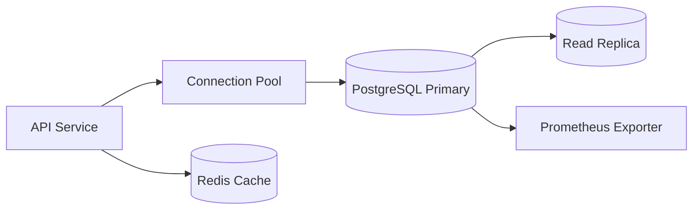

# Problem

Most PostgreSQL scaling problems begin as design problems: missing indexes, unbounded queries, poor pagination, chatty transactions, or using the primary database for analytics.

Scaling PostgreSQL starts with measurement, not sharding.

# First Principles

- Model data correctly.
- Add indexes for real query patterns.
- Avoid unbounded reads.
- Use cursor pagination for large lists.
- Keep transactions short.
- Use connection pooling.
- Move heavy analytics away from hot OLTP paths.

# Query Plan

Use `EXPLAIN ANALYZE` for slow queries. Look for:

- Sequential scans on large tables.
- Bad join order.
- Missing composite indexes.
- Sorts spilling to disk.
- Row estimates far from reality.

# Indexing

Indexes should match filters and ordering.

Example:

```sql
create index idx_orders_user_created
on orders (user_id, created_at desc);
```

This supports:

```sql
select *
from orders
where user_id = $1
order by created_at desc
limit 20;
```

# Architecture



# Connection Pooling

Too many application connections can overload PostgreSQL. Use a pooler such as PgBouncer or application-level pooling.

# Read Replicas

Use replicas for:

- Read-heavy dashboards.
- Search-like pages that tolerate replication lag.
- Reporting queries.

Do not use replicas for reads that must immediately reflect a write unless the app handles lag.

# Partitioning

Partition large time-series or event tables:

- Click events.
- Audit logs.
- Metrics.
- Notifications.

Partitioning helps retention, vacuum, and query targeting.

# Caching

Redis helps when reads are repeated and invalidation is understood. It does not replace database indexes.

# Monitoring

Track:

- Slow queries.
- Lock waits.
- Connection count.
- Replication lag.
- Index hit ratio.
- Table bloat.
- Transaction duration.
- CPU and I/O saturation.

# When To Shard

Shard only when:

- A single primary cannot handle writes.
- Data is naturally separable.
- Operational complexity is justified.
- Query patterns do not require constant cross-shard joins.

# Summary

PostgreSQL scales far when schema, indexes, queries, pooling, replicas, and caching are handled well. Sharding is a late-stage option, not the first move.
