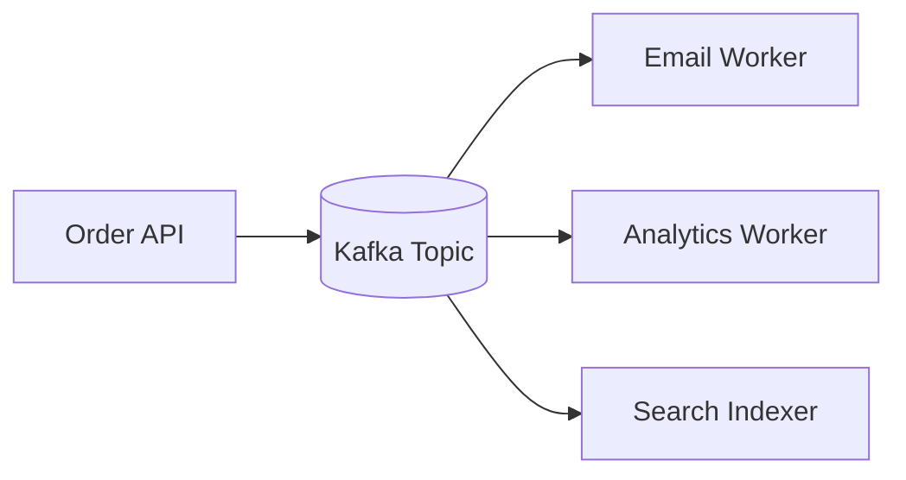
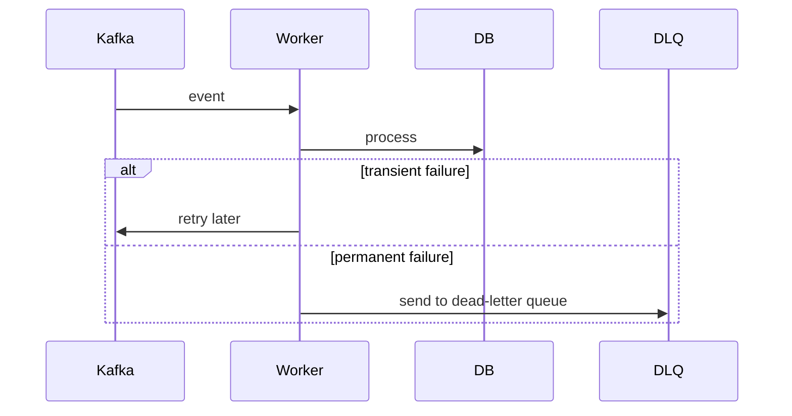

# Problem

Synchronous service calls couple systems together. If payment, email, analytics, and search indexing all happen in one request, a slow downstream service can break the user workflow.

Kafka lets systems publish facts and process them asynchronously.

# Core Concepts

- Topic: named stream of events.
- Partition: ordered log segment inside a topic.
- Producer: writes events.
- Consumer: reads events.
- Consumer group: scales processing across instances.
- Offset: consumer position in a partition.

# Architecture



# Event Design

Good events are facts:

```json
{
  "eventId": "evt_123",
  "eventType": "order.created",
  "occurredAt": "2026-07-01T12:00:00Z",
  "payload": {
    "orderId": "order_1",
    "userId": "user_1"
  }
}
```

# Idempotency

Consumers may receive events more than once. Every consumer should handle duplicates.

Patterns:

- Store processed `eventId`.
- Upsert instead of insert.
- Use deterministic output IDs.
- Make side effects idempotent with provider keys.

# Retries

Retry transient failures. Do not retry invalid data forever.

Flow:



# When To Use Kafka

- Event-driven workflows.
- Async side effects.
- Audit-friendly event streams.
- High-volume processing.
- Decoupling product workflows from background work.

# When Not To Use Kafka

- Simple request/response reads.
- Tiny applications where a queue is enough.
- Workflows requiring immediate strongly consistent responses.
- Teams that cannot monitor consumer lag and retries.

# Monitoring

Track:

- Consumer lag.
- Message throughput.
- Error rate by consumer.
- Dead-letter queue size.
- Rebalance count.
- Processing latency.

# Production Example

In the notification service design, product services publish `notification.requested`. Workers render templates, apply preferences, send channel-specific notifications, and store delivery attempts asynchronously.

# Summary

Kafka is not just a queue. It is a durable event log. Use it when the system benefits from decoupled, replayable facts.
