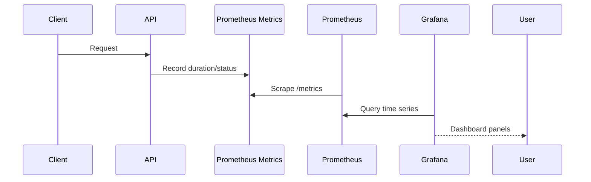

## Problem

Most portfolio projects show features but not operations.

Production systems need answers to operational questions:

- Is the API healthy?
- Are users seeing latency?
- Are errors increasing?
- Is Redis helping or hiding a problem?
- Is Kafka lag growing?
- Is PostgreSQL under pressure?

Observability turns those questions into metrics and dashboards.

## Metrics

Core API metrics:

- Request count.
- Request latency p50/p95/p99.
- Error rate by status code.
- Requests per second.
- Active database connections.

Business metrics:

- Orders created.
- Inventory mutations.
- Login failures.
- Cache invalidations.
- Background job failures.

Infrastructure metrics:

- CPU usage.
- Memory usage.
- Container restarts.
- Redis memory.
- Kafka consumer lag.

## Prometheus Design

```mermaid
flowchart LR
  API[FastAPI API] --> Metrics[/metrics]
  Worker[Background Worker] --> WorkerMetrics[/metrics]
  Prometheus --> Metrics
  Prometheus --> WorkerMetrics
  Grafana --> Prometheus
  Alerting[Alert Rules] --> Prometheus
```

Prometheus should scrape:

- API service.
- Worker service.
- Redis exporter.
- PostgreSQL exporter.
- Kafka exporter.

## Grafana Dashboard

Minimum useful dashboard:

- API latency p95.
- API requests per second.
- 4xx and 5xx error rate.
- Redis cache hit ratio.
- PostgreSQL query latency.
- Kafka consumer lag.
- Background worker failures.

Dashboard rule:

Every panel should answer a production question. Decorative charts do not help incident response.

## Alerts

Useful alerts:

- API p95 latency above SLO for 5 minutes.
- 5xx error rate above threshold.
- Redis cache hit ratio drops sharply.
- Kafka consumer lag grows continuously.
- Database connections near max.
- Background job failures spike.

## Request Flow



## Used In Portfolio

Lakhimpur Agri-Business documents Prometheus and Grafana as part of the backend platform:

- API latency.
- Error rate.
- Redis cache hits.
- Kafka lag.
- Background worker health.

This shows reviewers that the system is designed beyond local development.

## Summary

Observability is not an optional dashboard after launch. It is part of system design.

For senior engineering credibility, every backend project should explain what it measures, why it measures it, and how those signals help during failure.
