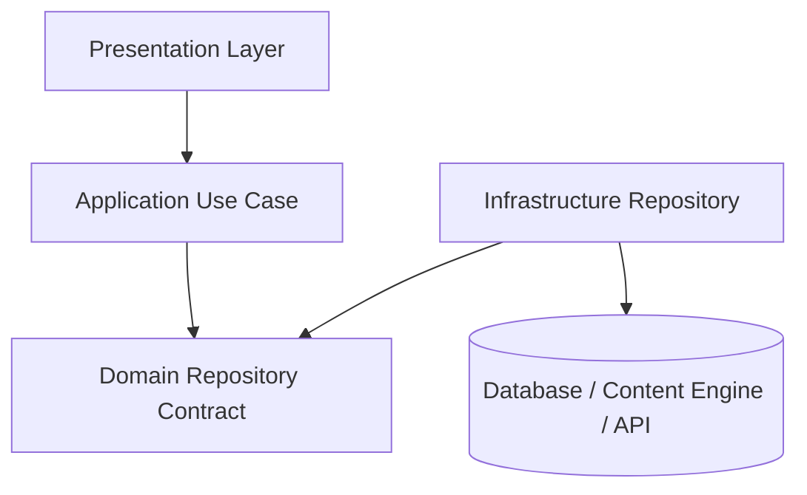

## Problem

Without a repository boundary, application code often talks directly to infrastructure:

- SQL queries in route handlers.
- ORM models leaking into domain logic.
- Nuxt Content queries scattered across Vue pages.
- HTTP clients called directly from use cases.
- Test suites that require real databases for simple business rules.

This creates tight coupling. Changing the database, content engine, ORM, or API client becomes expensive because infrastructure details have spread into the application.

## Without Repository

```ts
const document = await queryCollection('documentation')
  .where('slug', '=', route.params.slug)
  .first()

if (!document || document.status !== 'Published') {
  throw createError({ statusCode: 404 })
}
```

This works for a small page, but the route now knows:

- Which content engine is used.
- Which collection stores documents.
- How publish status is represented.
- How null values should be interpreted.

That is too much infrastructure knowledge for a page.

## Architecture



The domain owns the contract. Infrastructure owns the implementation.

## Implementation

Domain contract:

```ts
export interface DocumentationRepository {
  getAll(): Promise<Documentation[]>
  getBySlug(slug: string): Promise<Documentation | null>
  getByCategory(category: string): Promise<Documentation[]>
  getRelated(slug: string): Promise<Documentation[]>
}
```

Infrastructure implementation:

```ts
export class NuxtContentDocumentationRepository implements DocumentationRepository {
  async getBySlug(slug: string): Promise<Documentation | null> {
    const document = await queryCollection('documentation')
      .where('slug', '=', slug)
      .first()

    return document ? mapContentToDocumentation(document) : null
  }
}
```

Application use case:

```ts
export const getDocumentationBySlug = (slug: string) => {
  const repository = new NuxtContentDocumentationRepository()

  return repository.getBySlug(slug)
}
```

## FastAPI Example

```py
from typing import Protocol

class ProjectRepository(Protocol):
    async def get_by_slug(self, slug: str) -> Project | None:
        ...

class GetProject:
    def __init__(self, repository: ProjectRepository):
        self.repository = repository

    async def execute(self, slug: str) -> Project | None:
        return await self.repository.get_by_slug(slug)
```

Infrastructure adapter:

```py
class SqlAlchemyProjectRepository:
    def __init__(self, session):
        self.session = session

    async def get_by_slug(self, slug: str) -> Project | None:
        row = await self.session.scalar(select(ProjectModel).where(ProjectModel.slug == slug))
        return map_project_model(row) if row else None
```

## Nuxt Example

The portfolio documentation platform uses the same idea:

```ts
const document = await getDocumentationBySlug(slug)
const related = await getRelatedDocumentation(slug)
```

The page does not care that the content source is markdown.

## Pros

- Keeps business rules away from infrastructure details.
- Makes use cases easier to test.
- Enables swapping storage engines.
- Gives infrastructure code one place to handle mapping and null behavior.
- Makes architecture review easier because dependencies are explicit.

## Cons

- Adds files and interfaces.
- Can feel unnecessary for simple CRUD pages.
- Poorly designed repositories can become generic dumping grounds.
- Overusing repositories for every tiny read can slow delivery.

## When Not To Use

Avoid a repository abstraction when:

- The feature is a static one-off page.
- There is no domain rule and no expected persistence change.
- The abstraction would only rename a single framework call.
- The team cannot explain what dependency it is isolating.

The pattern should solve coupling, not decorate code.

## Real Production Example

In Lakhimpur Agri-Business, repositories would isolate:

- Farmer persistence.
- Inventory persistence.
- Sales records.
- Dashboard read models.
- Audit/event history.

Routes should not write SQL directly. Routes should call use cases. Use cases should depend on repository contracts. Infrastructure should own PostgreSQL, Redis, and Kafka details.

## Summary

Repository Pattern is valuable when a system has meaningful business rules, persistence complexity, or testability requirements.

In this portfolio, it demonstrates Staff-level thinking because it shows where boundaries belong and where they do not.
