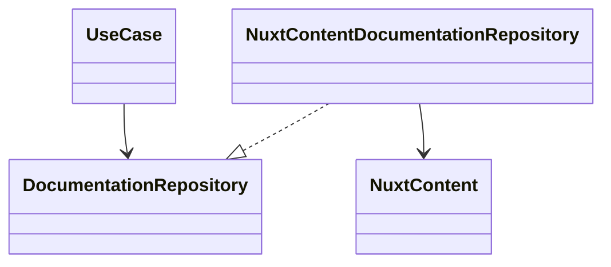

## Overview

The Repository Pattern provides a collection-like interface for domain objects while hiding persistence details behind a contract.

## Problem

Application logic becomes hard to test when it depends directly on SQL, ORM calls, HTTP clients, or Nuxt Content queries.

## Solution

Define a domain repository contract, implement it in infrastructure, and call it from application use cases.

```ts
export interface DocumentationRepository {
  getAll(): Promise<Documentation[]>
  getBySlug(slug: string): Promise<Documentation | null>
}
```

## UML Diagram



## FastAPI Example

```py
class ProjectRepository(Protocol):
    async def get_by_slug(self, slug: str) -> Project | None:
        ...
```

## Nuxt Example

```ts
const repository = new NuxtContentDocumentationRepository()
const documents = await repository.getAll()
```

## Used In Portfolio

The v2 documentation platform uses a domain repository contract and a Nuxt Content adapter so markdown never leaks into the domain model.

## Tradeoffs

- Adds a small layer of indirection.
- Makes tests easier because use cases depend on contracts.
- Protects the domain when the content engine changes.

## References

- Clean Architecture
- Domain-Driven Design
- Hexagonal Architecture
