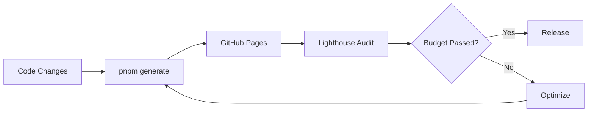

## Goal

The portfolio should target:

- Performance: 95+
- Accessibility: 95+
- SEO: 100
- Best Practices: 100
- CLS: near 0
- TBT: near 0 on static pages

These are targets, not claims. They must be verified with Lighthouse after deployment.

## Performance Strategy

Use static generation:

- Pages are generated ahead of time.
- HTML is served by GitHub Pages.
- No runtime server is needed.

Reduce critical path:

- Keep CSS compact.
- Avoid unnecessary client libraries.
- Use compressed images.
- Avoid shipping unused public assets.
- Use text and CSS for diagrams until interactive rendering is needed.

## Image Budget

Rules:

- Use WebP or AVIF for project images.
- Keep hero/detail images sized to actual display needs.
- Do not ship design-reference screenshots from `public`.
- Add width/height or stable aspect ratio to prevent CLS.

## Accessibility

Checklist:

- Semantic headings.
- Descriptive links.
- Sufficient color contrast.
- Keyboard-accessible navigation.
- Visible focus states.
- Meaningful alt text for project images.

## SEO

Checklist:

- Unique title and description per page.
- Clean route slugs.
- Static sitemap.
- Robots file.
- Descriptive page headings.
- Content organized around engineering topics, not random posts.

## Best Practices

Checklist:

- No browser console errors.
- No exposed secrets.
- External links use `noopener noreferrer`.
- HTTPS through GitHub Pages.
- Static assets are generated through CI.

## Core Web Vitals

CLS:

- Use fixed aspect ratios for images/cards.
- Avoid layout shifts from dynamic labels.

LCP:

- Keep first viewport simple.
- Prioritize the main hero/project image only where needed.
- Avoid blocking heavy JavaScript.

TBT:

- Avoid large client-only dependencies.
- Keep search lightweight until content volume requires indexing.

## Verification Flow

## Summary

Performance credibility comes from measurable budgets and repeatable checks.

The platform should not merely say "performance optimized." It should document the strategy, enforce static generation, and eventually verify the deployed site with Lighthouse CI.
