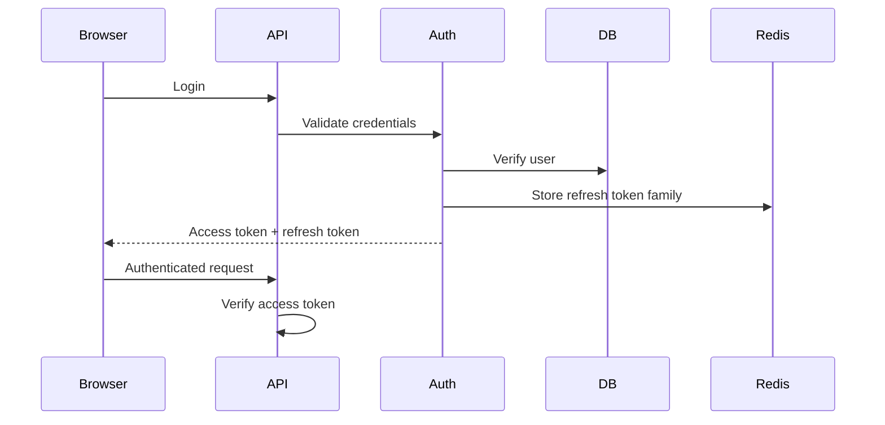

# Problem

JWT is easy to adopt and easy to misuse. Many applications treat a signed token as a complete security system. It is not.

JWT only proves that a token was signed by a trusted issuer and has not expired. Authorization, revocation, storage, refresh, and monitoring still need careful design.

# Common Mistakes

- Long-lived access tokens.
- Storing tokens in unsafe browser storage.
- Trusting roles forever after token issue.
- No refresh-token rotation.
- No logout or revocation strategy.
- Putting sensitive data inside token claims.
- Confusing authentication with authorization.

# Production Architecture

# Token Lifetime

Recommended pattern:

- Access token: short lifetime, usually minutes.
- Refresh token: longer lifetime, rotated on use.
- Refresh token family: revocable server-side.
- Sensitive operations: require recent authentication.

# Storage

Browser storage depends on the application threat model.

For many web apps:

- Prefer secure, HTTP-only cookies for refresh tokens.
- Keep access tokens short-lived.
- Use CSRF protection when cookies are used.
- Avoid storing high-value tokens in localStorage.

# Authorization

JWT claims can carry user ID, issuer, audience, expiry, and coarse permissions. The API should still enforce authorization from current business state when permissions are sensitive.

Example:

- Token says user ID is `user_1`.
- API checks whether `user_1` still owns or can access `order_123`.

# Revocation

Revocation options:

- Short access-token lifetime.
- Refresh-token rotation.
- Redis denylist for high-risk access tokens.
- User session version stored server-side.

# Monitoring

Track:

- Login failure rate.
- Refresh failure rate.
- Token replay detection.
- Revoked-token usage attempts.
- Permission-denied rate.
- Suspicious IP/device changes.

# When Not To Use JWT

- Server-rendered apps that only need simple sessions.
- Systems requiring immediate server-side session invalidation for every request.
- Teams that do not need stateless access-token verification.

# Summary

JWT is a token format, not a security architecture. Production authentication needs short lifetimes, refresh rotation, revocation strategy, authorization checks, secure storage, and observability.
