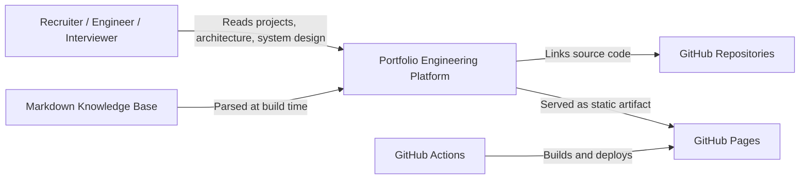
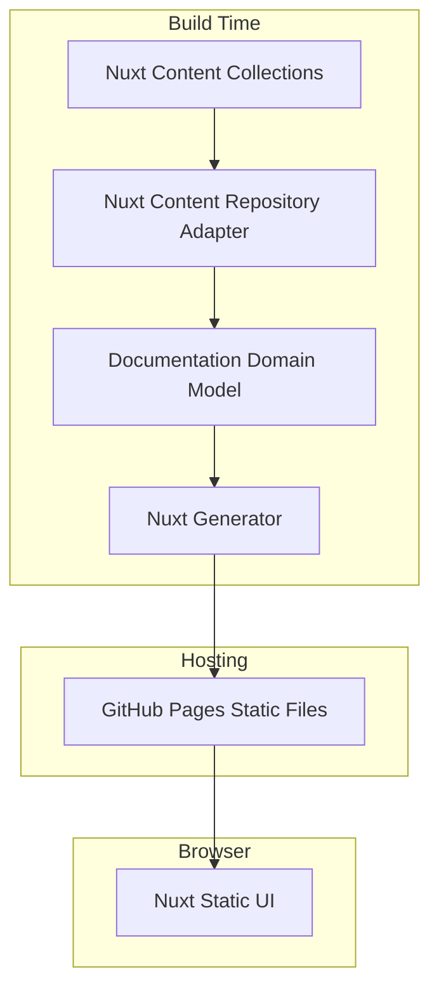
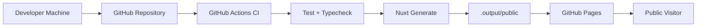
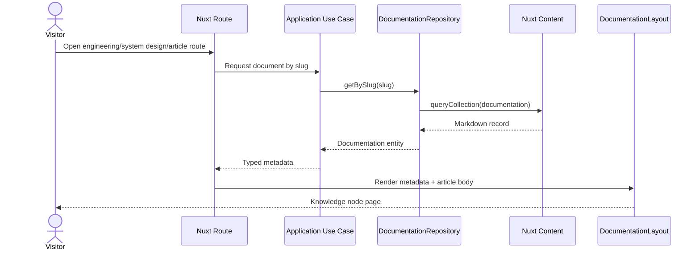

## Overview

The portfolio is designed as an engineering knowledge platform, not a brochure site.

Its purpose is to answer one senior-level hiring question:

Can this engineer design, document, test, deploy, and evolve software systems?

The platform organizes projects, case studies, HLDs, LLDs, ADRs, system-design exercises, engineering patterns, performance notes, and observability content into a single static Nuxt application.

## Requirements

Functional requirements:

- Publish project detail pages with architecture, APIs, deployment, performance, and lessons learned.
- Publish case studies with business problem, architecture, tradeoffs, monitoring, and future improvements.
- Publish engineering articles such as Repository Pattern, caching, performance, observability, and system design.
- Publish HLD, LLD, and ADR documents with reusable metadata.
- Support tag-based discovery for technologies such as FastAPI, PostgreSQL, Redis, Kafka, Docker, Prometheus, Grafana, and Nuxt.
- Generate a static site suitable for GitHub Pages.

Non-functional requirements:

- Static output must build successfully in CI.
- Pages must be crawlable and SEO-friendly.
- Content metadata must be validated before deploy.
- Navigation must remain understandable as the content count grows.
- The platform must be maintainable by one engineer without backend hosting cost.

## Constraints

- GitHub Pages is static hosting, so there is no server runtime after deployment.
- Nuxt Content runs at build time and packages content for client-side navigation.
- Mermaid diagrams are stored as markdown code blocks for portability.
- Search is initially metadata/list based, not a hosted full-text engine.
- Images must stay compressed because GitHub Pages is bandwidth-sensitive.

## Architecture Goals

- Show engineering thinking before visual polish.
- Keep markdown as the authoring format but never let markdown be the domain model.
- Use Clean Architecture boundaries where they reduce coupling.
- Make every page a knowledge node with category, subcategory, tags, related documents, and version.
- Keep the deploy target simple: static files produced by `nuxt generate`.

## C4 Context Diagram

## Container Diagram

## Deployment Diagram

## Sequence Diagram

## Tradeoffs

Static hosting:

- Positive: simple deployment, low cost, fast global availability through GitHub Pages.
- Negative: no server-side personalization, no database-backed search, no dynamic analytics pipeline.

Nuxt Content:

- Positive: typed content collections, markdown workflow, good integration with Nuxt.
- Negative: client bundle includes content runtime assets that must be watched for performance.

Clean Architecture:

- Positive: content engine can change without rewriting domain/use-case code.
- Negative: adds more files than a small portfolio normally needs.

## Scaling Strategy

Content scaling:

- Keep documents grouped by bounded context.
- Use tags and related documents for discovery.
- Keep metadata strict so generated indexes remain reliable.

Frontend scaling:

- Split pages by route.
- Keep shared documentation UI primitives small.
- Avoid adding heavy client-only libraries unless they unlock clear value.

Operational scaling:

- Keep deploy artifact static.
- Use GitHub Actions as the quality gate.
- Add Lighthouse CI once the content and routes stabilize.

## Security

- No secrets are shipped to the browser.
- External links use `rel="noopener noreferrer"`.
- Content is authored in-repo and reviewed through Git.
- Static hosting reduces server attack surface.
- Future contact forms should use a trusted external provider or serverless endpoint with rate limiting.

## Observability

The static site does not have backend telemetry, but the platform documents observability practices used in backend projects:

- Prometheus metrics.
- Grafana dashboards.
- Latency, error rate, traffic, and saturation.
- Build and deployment status from GitHub Actions.

## Future Improvements

- Add local full-text search.
- Add generated table of contents from markdown headings.
- Add Mermaid rendering instead of code-block diagrams.
- Add a knowledge graph page for tags and technologies.
- Add Lighthouse CI budgets for performance, accessibility, SEO, and best practices.

## Lessons Learned

- A portfolio becomes credible when it documents decisions, not just outcomes.
- Static hosting is enough for a knowledge platform if the content model is strong.
- Strict metadata turns markdown into a navigable system.
- Diagrams make senior-level thinking visible quickly.
