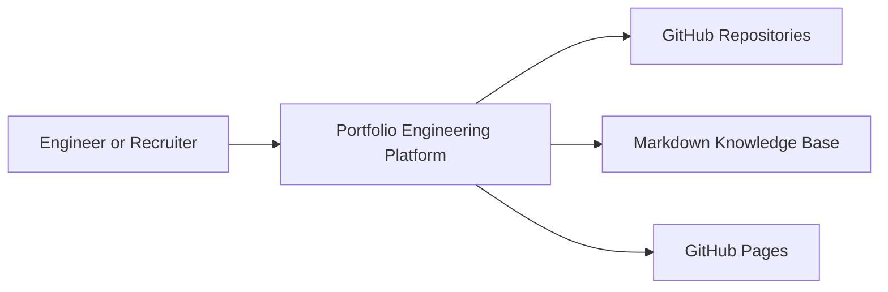

## Overview

The platform presents projects, case studies, engineering articles, architecture documents, and system design notes as a unified knowledge system.

## System Context

## Containers

- Static Nuxt application for presentation and routing.
- Nuxt Content database for markdown-backed knowledge nodes.
- Domain/application layers for contracts and use cases.
- GitHub Actions for CI, static generation, and deployment.

## Quality Attributes

- Static delivery for low operational complexity.
- Content-driven pages for fast iteration.
- Strict frontmatter schema for predictable metadata.
- Clean boundaries so documentation can evolve into search and graph features.

## Risks

- Nuxt Content adds client assets that must be monitored with Lighthouse.
- Large images need compression before final release.
- Search should be designed before content volume grows.
