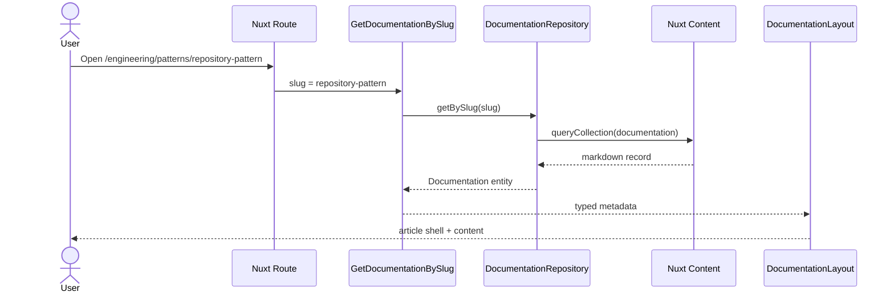

## Overview

The LLD defines how a markdown document becomes a typed knowledge node and a rendered documentation page.

## Request Flow



## Folder Structure

```txt
src/domain/documentation
src/application/documentation
src/infrastructure/documentation
src/presentation/components/docs
src/presentation/layouts/DocumentationLayout.vue
```

## Testing Strategy

- Schema validation protects content metadata.
- Unit tests cover content repository behavior as content volume grows.
- Static generation validates all routable pages before deployment.

## Deployment Flow

GitHub Actions installs dependencies, runs tests and typecheck, generates static assets, and publishes `.output/public` to GitHub Pages.
