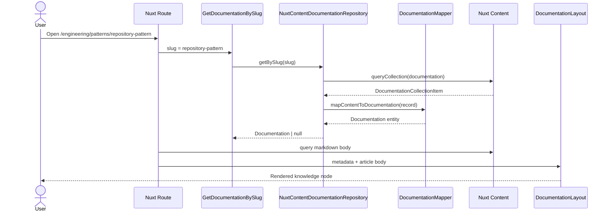
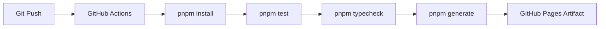

## Overview

The documentation platform converts markdown documents into typed knowledge nodes and renders them through reusable documentation UI.

The design goal is simple:

Markdown is the storage format. The domain model is the contract.

## Repository Layer

The domain defines the repository contract:

```ts
export interface DocumentationRepository {
  getAll(): Promise<Documentation[]>
  getBySlug(slug: string): Promise<Documentation | null>
  getByCategory(category: string): Promise<Documentation[]>
  getRelated(slug: string): Promise<Documentation[]>
}
```

The application layer depends on this contract. It does not know that the current implementation uses Nuxt Content.

## Service Layer

The current implementation uses small use cases instead of a heavy service class:

- `GetDocumentation`
- `GetDocumentationBySlug`
- `GetRelatedDocumentation`

This is enough for the current complexity. A dedicated service can be introduced later if ranking, graph traversal, search scoring, or authorization rules become non-trivial.

## Content Layer

Content is stored under:

```txt
src/content/documentation
├── adr
├── engineering
│   └── patterns
├── hld
├── lld
└── system-design
```

Every markdown file must provide the same frontmatter contract:

```yaml
title:
slug:
summary:
category:
subcategory:
difficulty:
readingTime:
status:
version:
tags:
technologies:
related:
author:
publishedAt:
updatedAt:
```

## Renderer

The renderer is split into two responsibilities:

- `DocumentationLayout.vue` renders the shell: breadcrumbs, title, metadata, tags, sidebars, article slot, and related documents.
- `ContentRenderer` renders the markdown body from Nuxt Content.

This keeps visual layout separate from content parsing.

## Nuxt Pages

The route layer is thin:

- Read slug from route params.
- Fetch typed metadata through the use case.
- Fetch the markdown body from Nuxt Content.
- Throw a typed 404 if either is missing.
- Render through `DocumentationLayout`.

## Composable Boundary

Global composables should not contain business rules. They should be limited to:

- SEO helpers.
- UI state.
- Query param helpers.

Content rules belong in the documentation repository or application use cases.

## Markdown Parser

Nuxt Content parses markdown at build time and exposes it through typed collections.

The mapper converts the parsed content record into the `Documentation` entity:


## Caching

Static generation is the primary cache:

- HTML is generated ahead of time.
- Payload files are emitted for client navigation.
- GitHub Pages serves immutable built assets.

Future caching options:

- Cache search index generation during build.
- Precompute tag pages.
- Precompute related-document lists.

## Error Handling

Route-level errors:

- Missing metadata: return 404.
- Missing content body: return 404.
- Invalid frontmatter: fail build through schema validation.

Content-level errors:

- Broken diagram syntax should be caught by review until a diagram renderer/linter is introduced.
- Missing related slug should be caught by a future content integrity test.

## Sequence Diagram



## Folder Structure

```txt
src/
├── application/documentation/useCases
├── domain/documentation/entities
├── domain/documentation/repositories
├── domain/documentation/valueObjects
├── infrastructure/documentation/mappers
├── infrastructure/documentation/repositories
├── presentation/components/docs
└── presentation/layouts/DocumentationLayout.vue
```

## Testing Strategy

Current verification:

- Nuxt Content schema validates required metadata.
- `pnpm typecheck` validates TypeScript boundaries.
- `pnpm test` validates existing unit/smoke checks.
- `pnpm generate` validates static routability.

Planned tests:

- Repository mapper unit tests.
- Related document integrity tests.
- Required heading tests for HLD, LLD, ADR, and system design documents.
- Broken link detection.

## Deployment Flow



## Future Improvements

- Add a build-time search index.
- Add Mermaid rendering with progressive enhancement.
- Add content linting for required sections.
- Add generated previous/next navigation.
- Add a real knowledge graph view by tag and technology.
