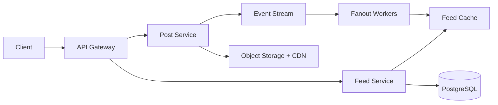

## Overview

Designing an Instagram-like feed requires balancing write fanout, read latency, ranking freshness, and media delivery.

## Requirements

- Users follow other users.
- Users upload images and videos.
- Home feed loads quickly.
- Feed supports ranking and pagination.
- System handles celebrity accounts.

## High Level Design

## Data Model

- User
- Follow
- Post
- MediaAsset
- FeedItem

## Scaling Strategy

- Fanout-on-write for normal users.
- Fanout-on-read for celebrity accounts.
- Redis sorted sets for timeline windows.
- CDN for media.
- Kafka for asynchronous post distribution.

## Tradeoffs

- Fanout-on-write improves read latency but increases write amplification.
- Fanout-on-read reduces write cost for large accounts but increases request-time work.
- Ranking can be precomputed for speed or computed dynamically for freshness.
