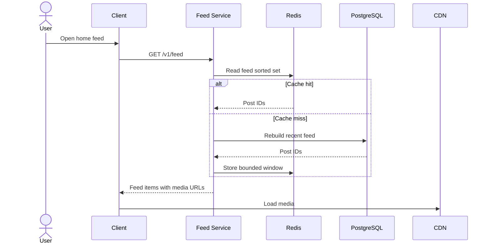
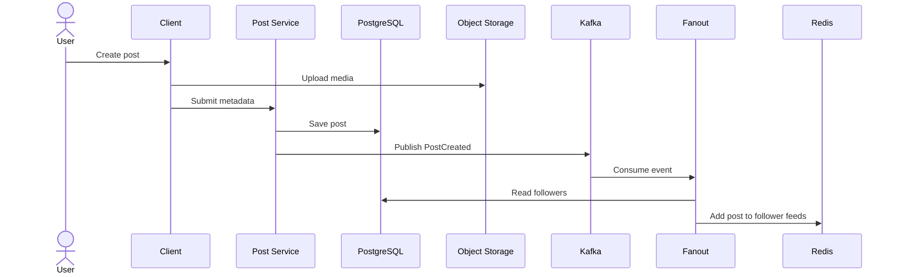
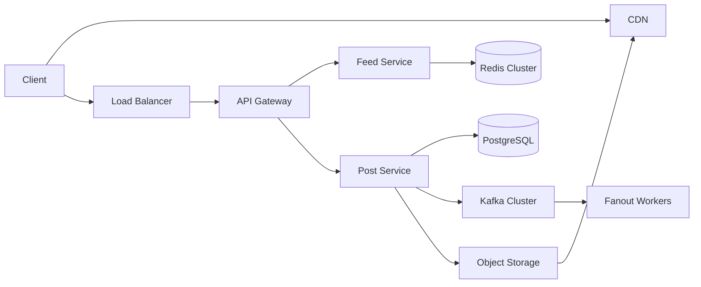

## Requirements

Functional requirements:

- Users can create posts with image/video media.
- Users can follow and unfollow other users.
- Users can view a home feed.
- Feed supports pagination.
- Feed can include ranked posts.
- Users can like and comment on posts.

Non-functional requirements:

- Low feed read latency.
- High availability for reads.
- Durable post storage.
- Efficient media delivery through CDN.
- Reasonable freshness for new posts.
- Graceful handling of celebrity accounts.

## Capacity Estimation

Assumptions:

- 100 million daily active users.
- 20 million users create posts daily.
- Average post size metadata: 2 KB.
- Average media stored externally in object storage.
- Average user follows 300 accounts.
- Feed read traffic is much higher than write traffic.

Implications:

- Feed reads must be optimized aggressively.
- Media must never be served directly from application servers.
- Fanout strategy must avoid exploding writes for celebrity accounts.
- Cache storage must be bounded by recent feed windows.

## API Design

```http
POST /v1/posts
GET /v1/feed?cursor=...
POST /v1/users/{id}/follow
DELETE /v1/users/{id}/follow
POST /v1/posts/{id}/likes
POST /v1/posts/{id}/comments
```

Example feed response:

```json
{
  "items": [
    {
      "postId": "post_123",
      "authorId": "user_456",
      "mediaUrl": "https://cdn.example.com/media/post_123.webp",
      "caption": "Harvest update",
      "createdAt": "2026-06-30T10:00:00Z",
      "rankScore": 0.91
    }
  ],
  "nextCursor": "cursor_abc"
}
```

## Database

Core tables:

- `users`
- `follows`
- `posts`
- `media_assets`
- `likes`
- `comments`
- `feed_items`

Important indexes:

- `follows(follower_id, followee_id)`
- `posts(author_id, created_at)`
- `feed_items(user_id, rank_score, created_at)`
- `likes(post_id, user_id)`

## Redis

Redis stores hot feed windows:

- Key: `feed:{user_id}`
- Data structure: sorted set.
- Score: rank score or timestamp.
- Value: post ID.
- TTL: bounded based on activity.

Redis is not the source of truth. It is a read optimization.

## Kafka

Kafka carries post-created events:

```json
{
  "eventType": "PostCreated",
  "postId": "post_123",
  "authorId": "user_456",
  "createdAt": "2026-06-30T10:00:00Z"
}
```

Consumers:

- Fanout worker.
- Notification worker.
- Ranking feature worker.
- Analytics worker.

## Fanout

Two fanout strategies are used:

Fanout-on-write:

- Used for normal accounts.
- When a user posts, write the post ID into follower feeds.
- Optimizes read latency.

Fanout-on-read:

- Used for celebrity accounts.
- Do not write to millions of followers at post time.
- Merge celebrity posts during feed read.

Hybrid fanout is the practical production choice.

## Read Model



## Write Model



## Tradeoffs

Fanout-on-write:

- Faster reads.
- More expensive writes.
- Bad for celebrity accounts.

Fanout-on-read:

- Cheaper writes.
- More expensive reads.
- Requires merge logic.

Redis feed cache:

- Great latency.
- Needs invalidation and bounded memory.
- Must tolerate cache rebuilds.

## Failure Recovery

- Kafka consumers must be idempotent.
- Fanout workers should store offsets safely.
- Failed fanout jobs should retry with backoff.
- Feed service should fall back to database rebuild on Redis miss.
- Media upload should use pre-signed URLs to avoid API bottlenecks.

## Monitoring

Metrics:

- Feed read latency p50/p95/p99.
- Feed cache hit ratio.
- Kafka consumer lag.
- Fanout job success/failure count.
- Post creation latency.
- Redis memory usage.
- Database query latency.
- CDN error rate.

Alerts:

- Consumer lag above threshold.
- Feed p95 latency above SLO.
- Redis memory pressure.
- Database connection saturation.
- Media upload failure spike.

## Deployment



## Scaling

- Horizontally scale stateless API services.
- Partition Kafka by author ID or post ID.
- Shard Redis feed keys by user ID.
- Use read replicas for feed rebuild queries.
- Use CDN for all media delivery.
- Separate hot celebrity paths from normal user fanout.

## Interview Questions

- Why not fanout every post to every follower?
- How do you handle celebrity accounts?
- What happens when Redis is down?
- How do you rebuild a feed?
- How do you rank feed items?
- What should be strongly consistent?
- What can be eventually consistent?

## Summary

The core design is a hybrid feed system:

- PostgreSQL stores durable relationships and posts.
- Object storage and CDN serve media.
- Kafka decouples post creation from fanout.
- Redis stores hot feed windows.
- Fanout-on-write serves normal users.
- Fanout-on-read protects the system from celebrity write amplification.
