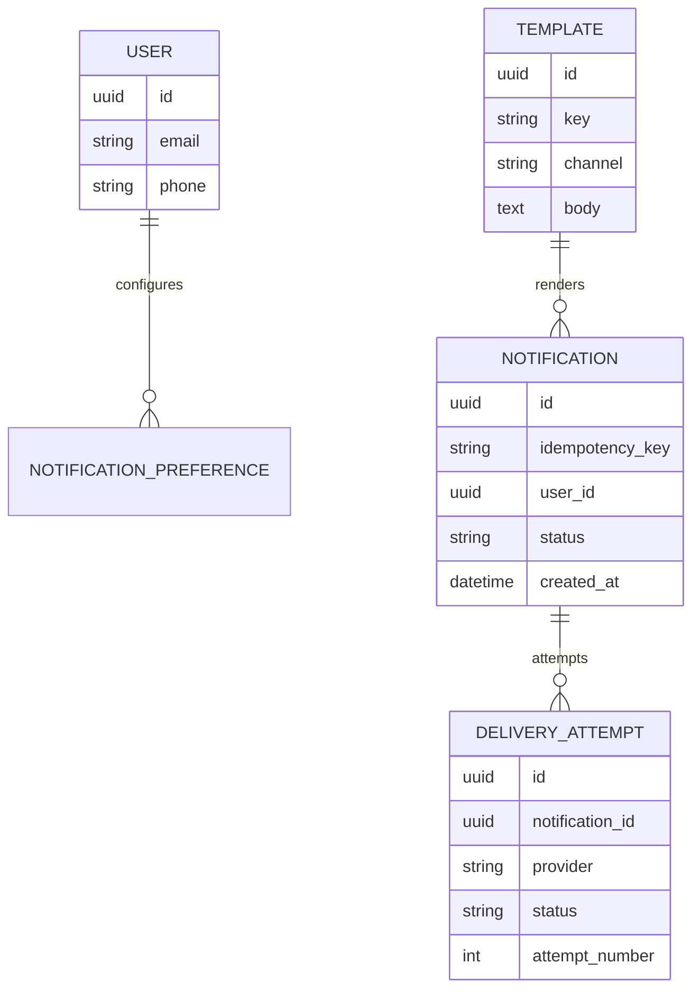
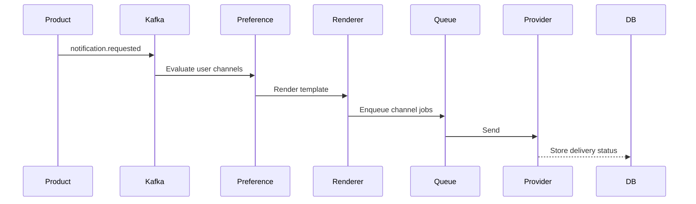
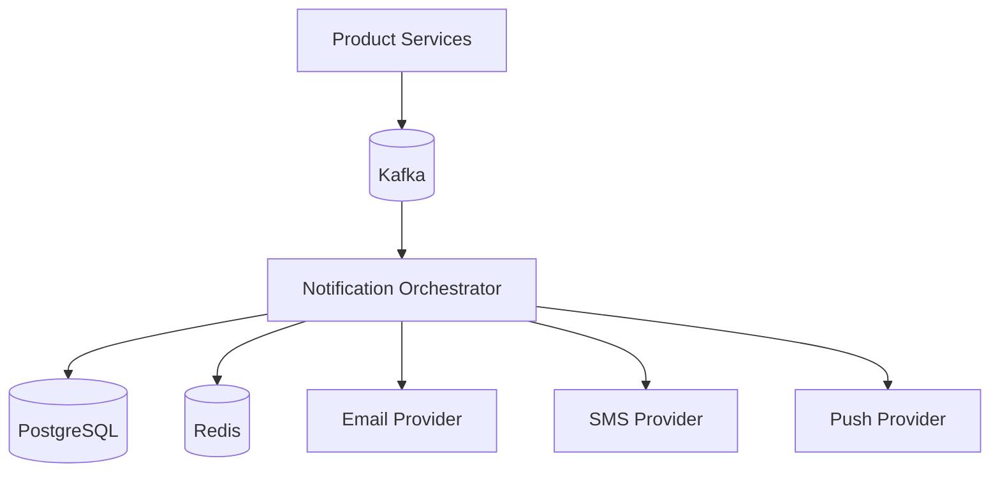

# Overview

A notification service sends email, SMS, push, and in-app notifications. The service must respect user preferences, provider limits, retry rules, idempotency, and observability.

# Requirements

Functional:

- Send notification requests through an API or event.
- Support email, SMS, push, and in-app channels.
- Render templates with variables.
- Respect user preferences.
- Retry failed provider calls.
- Store delivery status.

Non-functional:

- Do not block upstream product workflows.
- Avoid duplicate sends.
- Handle provider outages.
- Provide audit trails for delivery.

# Capacity Estimation

Assumptions:

- 10 million notifications per day.
- Peak rate 5 thousand notifications per second.
- Email and push dominate volume.
- SMS is lower volume but higher cost.

# API Design

```http
POST /api/notifications
GET  /api/notifications/{notification_id}
POST /api/templates
GET  /api/users/{user_id}/preferences
PUT  /api/users/{user_id}/preferences
```

Request:

```json
{
  "idempotencyKey": "order_123_shipped",
  "userId": "user_1",
  "template": "order_shipped",
  "channels": ["email", "push"],
  "variables": {
    "orderId": "123"
  }
}
```

# Database



# Redis

Redis responsibilities:

- Provider rate limits.
- Idempotency locks.
- Short-lived template cache.
- Retry delay queues when Kafka is not enough.

# Kafka

Topics:

- `notification.requested`
- `notification.rendered`
- `notification.delivery_attempted`
- `notification.delivered`
- `notification.failed`

# Fanout

A single product event can fan out to multiple channels based on preference evaluation.



# Read Model

Operational dashboards need:

- Notification status.
- Last delivery attempt.
- Provider response.
- Retry count.
- Channel breakdown.

# Write Model

Send flow:

1. Accept request with idempotency key.
2. Resolve user preferences.
3. Render template.
4. Create notification record.
5. Enqueue channel-specific delivery jobs.
6. Retry failures with backoff.
7. Mark final status.

# Tradeoffs

- Synchronous sends are simple but fragile.
- Async queues improve reliability but add eventual consistency.
- Multi-provider support improves resilience but increases testing complexity.
- Idempotency prevents duplicate sends but requires key discipline.

# Failure Recovery

- Provider timeouts retry with exponential backoff.
- Permanent failures are stored and surfaced.
- Duplicate events are deduped by idempotency key.
- Dead-letter queues keep poison messages inspectable.

# Monitoring

Metrics:

- Notification request rate.
- Delivery success rate by channel.
- Provider latency.
- Provider error rate.
- Retry count.
- Dead-letter queue size.
- Kafka lag.

# Deployment



# Scaling

- Partition Kafka by user ID or notification ID.
- Scale delivery workers by channel.
- Use provider-specific rate limiters.
- Store immutable delivery attempts for audit.
- Move reporting to read replicas or analytics storage.

# Interview Questions

- How do you avoid duplicate SMS sends?
- How do you handle provider outages?
- What data should be immutable?
- Where do user preferences get applied?
- How do you debug a missing notification?

# Summary

A notification service is an orchestration system. Principal-level design means protecting product workflows from provider instability while keeping delivery observable and auditable.
