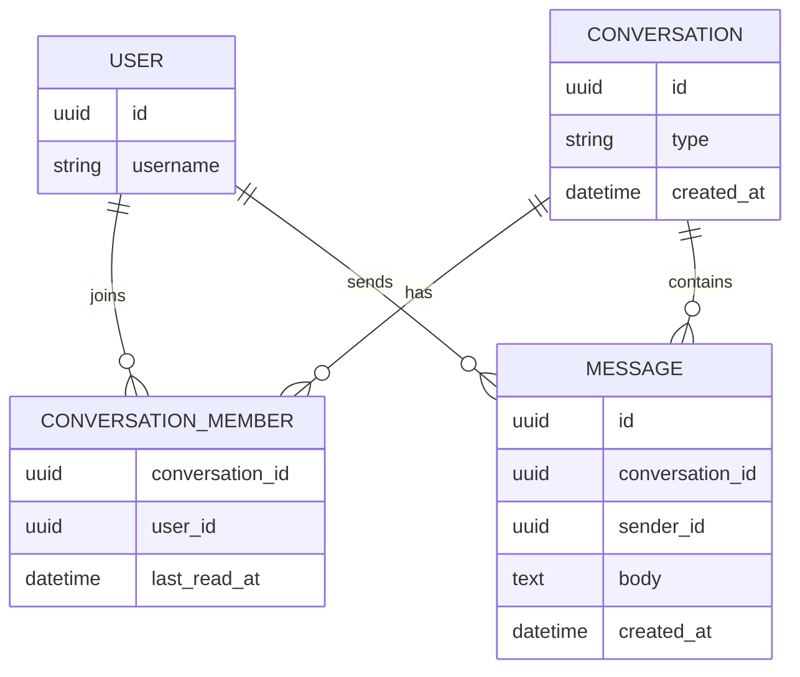
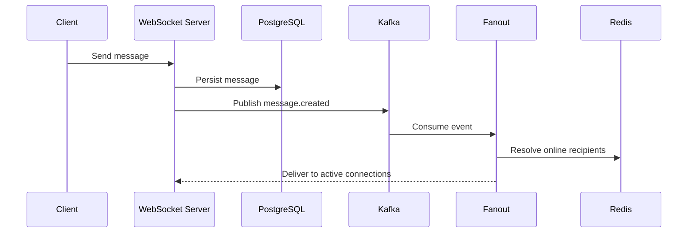
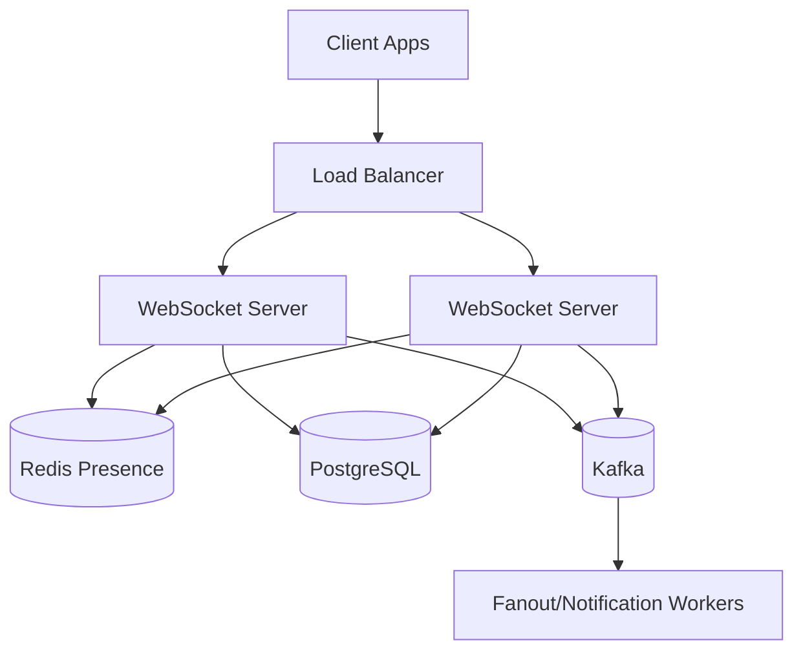

# Overview

A realtime chat system delivers messages between users with low latency while preserving message history and reasonable delivery guarantees.

The difficult part is not sending one WebSocket message. The difficult part is presence, reconnects, ordering, fanout, persistence, unread counts, and failure recovery.

# Requirements

Functional:

- One-to-one and group messaging.
- WebSocket realtime delivery.
- Message history.
- Read receipts.
- Online presence.
- Push notification handoff for offline users.

Non-functional:

- Low message delivery latency.
- Durable message storage.
- Horizontal scaling for connection servers.
- At-least-once internal event delivery.

# Capacity Estimation

Assumptions:

- 1 million daily active users.
- 100 thousand concurrent WebSocket connections.
- 50 messages per active user per day.
- 50 million messages per day.

Storage:

- Message body plus metadata can quickly reach tens of GB per day.
- Attachments should use object storage, not PostgreSQL rows.

# API Design

```http
GET  /api/conversations
GET  /api/conversations/{conversation_id}/messages?cursor=...
POST /api/conversations/{conversation_id}/messages
POST /api/conversations/{conversation_id}/read
GET  /ws
```

WebSocket message:

```json
{
  "type": "message.created",
  "conversationId": "conv_123",
  "messageId": "msg_456",
  "senderId": "user_1",
  "body": "hello",
  "sentAt": "2026-07-01T12:00:00Z"
}
```

# Database



# Redis

Redis responsibilities:

- Presence: `presence:{user_id}`.
- Connection routing: `connection:{user_id}` -> server ID.
- Recent messages cache for hot conversations.
- Rate limiting for message sends.

# Kafka

Kafka decouples message persistence from fanout, notifications, indexing, and analytics.

Topics:

- `message.created`
- `message.delivered`
- `message.read`
- `presence.changed`

# Fanout

Small groups can use fanout-on-write: publish to every active recipient connection. Large groups may need fanout-on-read or a hybrid model.



# Read Model

Read endpoints use cursor pagination by `created_at` and `message_id`. Conversation lists should use a denormalized summary:

- Last message preview.
- Last message timestamp.
- Unread count.
- Participant display data.

# Write Model

Message send flow:

1. Authenticate WebSocket.
2. Validate conversation membership.
3. Persist message.
4. Publish event.
5. Fan out to active recipients.
6. Trigger notification for offline recipients.

# Tradeoffs

- PostgreSQL is simpler for first versions but partitioning may be needed.
- WebSockets give realtime UX but require connection state.
- At-least-once events can duplicate delivery; clients need idempotency.
- Exactly-once delivery is usually too expensive for chat UX.

# Failure Recovery

- Clients reconnect with last seen message ID.
- Fanout failures are retried from Kafka.
- Duplicate messages are ignored by message ID.
- If presence is stale, delivery falls back to pull on reconnect.

# Monitoring

Metrics:

- Active WebSocket connections.
- Message send p95 latency.
- Kafka lag.
- Fanout failure rate.
- Reconnect rate.
- Message persistence errors.
- Presence key churn.

# Deployment



# Scaling

- Scale WebSocket servers horizontally.
- Use Redis for connection routing.
- Partition Kafka by conversation ID for ordering.
- Partition message tables by time or conversation hash.
- Move attachment storage to object storage.

# Interview Questions

- How do you preserve ordering?
- How do users receive missed messages after reconnect?
- How does fanout change for large groups?
- How do you avoid duplicate messages?
- What state belongs in Redis vs PostgreSQL?

# Summary

Realtime chat is an event-driven system with stateful edges. The core design skill is separating connection state, durable message state, and asynchronous fanout.
