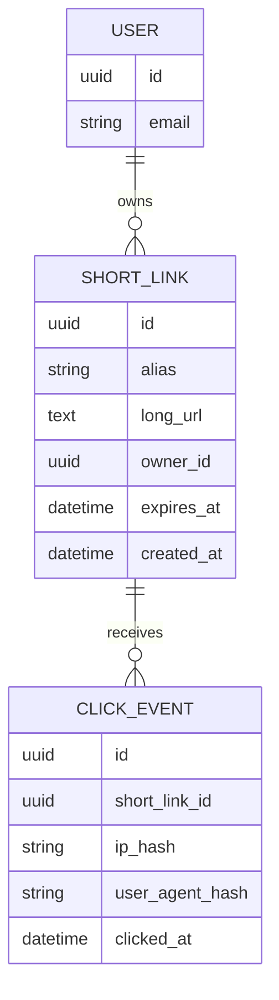
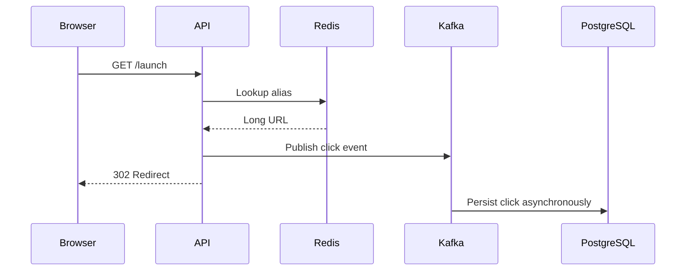
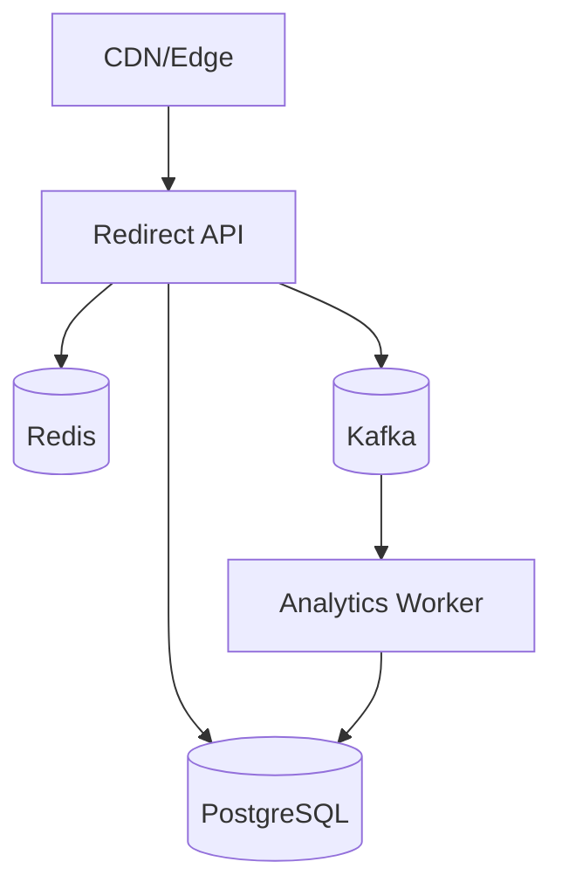

# Overview

A URL shortener converts long URLs into compact aliases and redirects users with low latency. The product looks simple, but the design tests core backend skills: ID generation, cache strategy, database indexing, abuse prevention, analytics, and read-heavy scaling.

# Requirements

Functional:

- Create short links for long URLs.
- Redirect short links to original URLs.
- Support optional custom aliases.
- Track click events.
- Expire links when configured.

Non-functional:

- Redirect p95 below 50 ms when cached.
- High availability for redirects.
- Strong uniqueness for aliases.
- Protection against spam and brute-force alias scanning.

# Capacity Estimation

Assumptions:

- 1 million new URLs per day.
- 100 million redirects per day.
- Read/write ratio around 100:1.
- Average long URL size: 500 bytes.
- Average alias size: 8 to 10 characters.

Storage estimate:

- 1 million URLs/day * 365 = 365 million rows/year.
- Metadata plus indexes may reach hundreds of GB per year.
- Click analytics should be separated from the primary redirect table.

# API Design

```http
POST /api/links
GET  /{alias}
GET  /api/links/{alias}
DELETE /api/links/{alias}
GET  /api/links/{alias}/analytics
```

Create request:

```json
{
  "longUrl": "https://example.com/very/long/path",
  "customAlias": "launch",
  "expiresAt": "2026-12-31T00:00:00Z"
}
```

# Database



Indexes:

- Unique index on `short_links(alias)`.
- Index on `short_links(owner_id, created_at desc)`.
- Partition click events by time for analytics.

# Redis

Redis stores redirect hot paths.

Keys:

- `short:{alias}` -> long URL and expiry metadata.
- `rate:create:{user_id}` -> token bucket for create requests.
- `rate:redirect:{ip}` -> lightweight abuse control.

TTL should match link expiry when possible.

# Kafka

Redirect should not synchronously write every click event to PostgreSQL. A redirect endpoint can publish click events to Kafka and return the redirect immediately.



# Fanout

No social fanout is required. Analytics fanout can happen asynchronously:

- Raw click event.
- Aggregated daily counters.
- Abuse detection stream.
- Owner dashboard metrics.

# Read Model

The redirect read model is alias to URL. It should be denormalized and cacheable.

```json
{
  "alias": "launch",
  "longUrl": "https://example.com/very/long/path",
  "expiresAt": "2026-12-31T00:00:00Z",
  "active": true
}
```

# Write Model

Create link flow:

1. Validate URL.
2. Check rate limit.
3. Generate alias or validate custom alias.
4. Insert with unique constraint.
5. Warm Redis cache.
6. Return public short URL.

# Tradeoffs

- Sequential IDs are compact but easier to enumerate.
- Random aliases reduce enumeration risk but can collide.
- Synchronous analytics are simpler but slow redirects.
- Async analytics are faster but eventually consistent.
- PostgreSQL is enough for metadata; analytics may need partitions or a warehouse later.

# Failure Recovery

- If Redis is down, fall back to PostgreSQL.
- If Kafka is down, redirect should still work and sample/drop analytics after logging.
- If database is down, cached redirects can continue until TTL expires.
- Alias generation should retry on unique collisions.

# Monitoring

Metrics:

- Redirect p50/p95/p99 latency.
- Redis hit ratio.
- Alias collision count.
- Create-link error rate.
- Kafka lag.
- 404 rate by alias.
- Rate-limit rejection count.

# Deployment



# Scaling

- Cache hot aliases at Redis and CDN.
- Partition click events by time.
- Read replicas can serve owner dashboards.
- Shard alias space only after PostgreSQL plus Redis no longer meet latency.

# Interview Questions

- How would you prevent alias enumeration?
- What happens when Redis is unavailable?
- How do you track analytics without slowing redirects?
- How do you handle custom alias collisions?
- When would you shard the database?

# Summary

The core design is a read-optimized redirect path backed by Redis, PostgreSQL, and asynchronous analytics. The Staff-level concern is not the endpoint; it is the failure behavior under a read-heavy workload.
