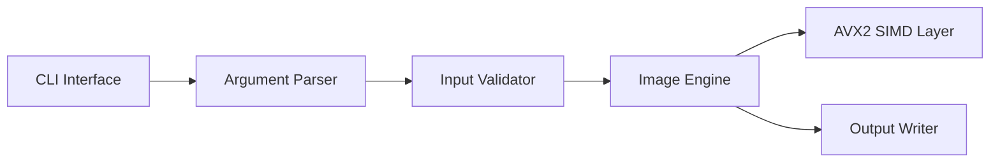

# Overview

IMGENGINE is a high-performance image processing CLI focused on batch image workflows, predictable memory usage, and Linux-first systems programming.

The project demonstrates low-level engineering concerns that do not show up in ordinary CRUD applications: memory layout, data movement, CPU-friendly processing, and operational simplicity from the command line.

# Problem

Image processing workloads can become expensive when each transformation repeatedly allocates memory, copies buffers, or hides expensive operations behind broad abstractions. For a CLI tool, the user also expects clear input/output behavior, scriptability, and failure modes that are easy to debug.

The engineering problem was to design a compact image pipeline that keeps the command interface simple while leaving room for optimized internals.

# Solution

The solution is a layered CLI architecture:

- A command interface parses user intent.
- A validation layer rejects invalid inputs early.
- The image engine owns decoding, transformation, and output orchestration.
- SIMD-focused routines can optimize hot paths without leaking complexity into the CLI boundary.

# Architecture Diagram

# Tech Stack

- C for memory control and predictable performance.
- Linux for the target execution environment.
- AVX2/SIMD for hot-path optimization experiments.
- Shell-friendly CLI conventions for automation.

# Challenges

- Keeping manual memory ownership understandable.
- Avoiding premature optimization before profiling.
- Designing a CLI that is strict enough for scripts but friendly during local use.
- Separating optimized routines from the higher-level transformation pipeline.

# Lessons Learned

- Cache locality and allocation strategy matter before clever algorithms.
- Profiling should decide what deserves SIMD work.
- A boring CLI contract is a feature when the tool is used in scripts.
- Clear module boundaries make low-level code easier to test and evolve.

# GitHub

Source code: [IMGENGINE](https://github.com/Rofikali/imgengine)

# Live Demo

The live demo is the repository README and CLI usage documentation. A browser-hosted demo is not planned for v0.1 because the project is intentionally a local systems CLI.
