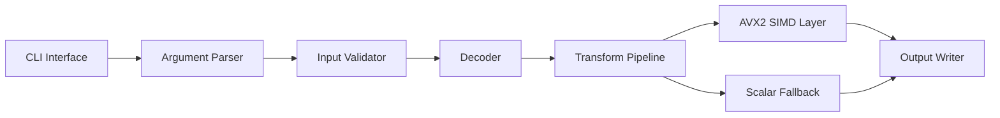
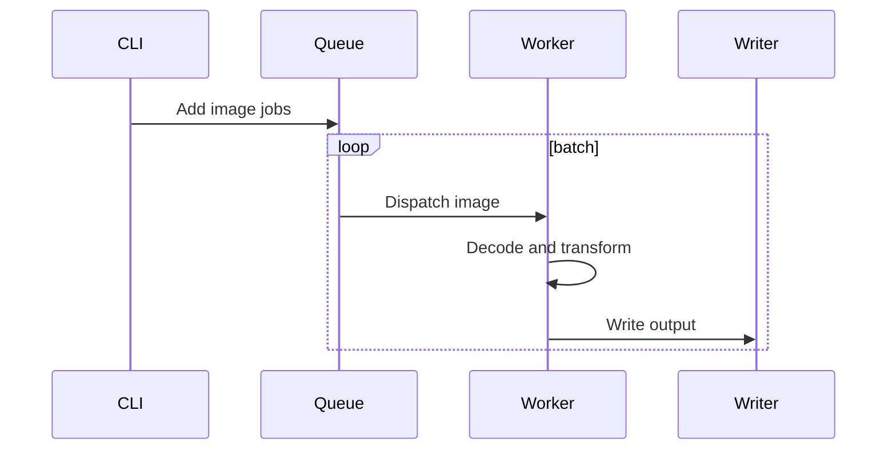
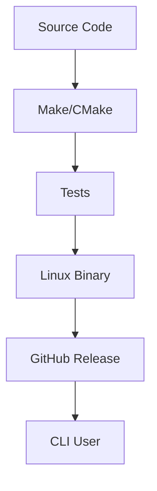

# Overview

IMGENGINE is a high-performance image processing CLI focused on predictable memory usage, Linux workflows, and CPU-aware optimization.

The project demonstrates systems-level engineering: command contracts, memory layout, buffer ownership, profiling, SIMD hot paths, and release packaging.

# Architecture



# Screenshots

Primary project visual: `/images/projects/imgengine.webp`.

Future screenshots should include terminal usage, benchmark output, and before/after image transformations.

# API Design

IMGENGINE is a CLI, so the public API is the command interface.

```bash
imgengine resize --input input.jpg --output output.jpg --width 1280
imgengine batch --input ./images --output ./dist --format webp
imgengine bench --input sample.jpg --operation resize
```

# Database Schema

No relational database is required. The persistence boundary is the filesystem.

Filesystem contract:

- Validate input before processing.
- Avoid accidental overwrite unless explicitly requested.
- Emit non-zero exit codes for failures.
- Keep temporary files isolated.

# Caching

Caching is local and memory-oriented:

- Reuse buffers across batch jobs.
- Keep hot pixel data contiguous.
- Avoid allocation inside inner loops.
- Add tiled processing for very large images.

# Messaging

Batch processing is modeled as a local queue.



# Monitoring

CLI observability:

- Verbose logs.
- Benchmark mode.
- Phase timing for decode, transform, and write.
- Exit-code summary.
- Sanitizer and Valgrind checks during development.

# Deployment



# Performance

Targets:

- No unbounded memory growth during batch processing.
- No allocation inside hot transform loops.
- SIMD paths verified against scalar output.
- Benchmarks documented by CPU, image size, and operation.

# Lessons Learned

- Profiling decides what should be optimized.
- SIMD should be isolated behind a small interface.
- Command-line reliability is part of product quality.
- Manual memory management needs strict ownership rules.

# GitHub

Source code: [IMGENGINE](https://github.com/Rofikali/imgengine)

# Live Demo

The repository README and CLI usage documentation are the live technical preview for v0.1.
