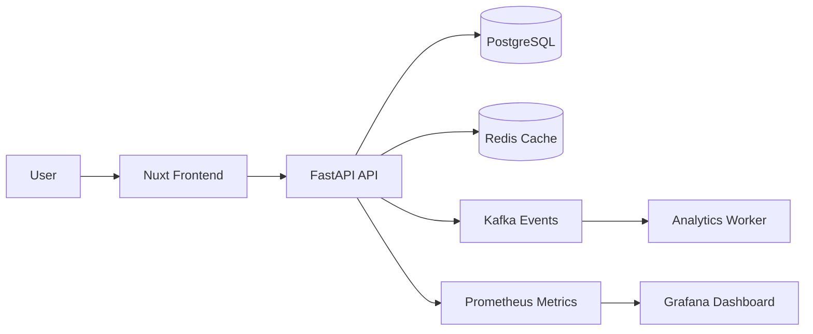

# Overview

Lakhimpur Agri-Business is a production-oriented business platform for agricultural inventory, farmer records, sales workflows, and operational analytics.

The project is designed as a full-stack system rather than a single-page demo. It emphasizes API boundaries, database design, caching, async event flow, deployment repeatability, and monitoring.

# Problem

Agricultural businesses often manage inventory, farmer relationships, and sales data across spreadsheets or disconnected tools. That creates reporting delays, inconsistent stock records, and weak visibility into operational health.

The engineering problem was to model the business domain clearly enough that inventory, users, analytics, and background workflows can evolve without turning the backend into a tightly coupled controller layer.

# Solution

The solution uses a Nuxt frontend backed by a FastAPI service with PostgreSQL as the system of record. Redis handles hot reads and short-lived operational state, while Kafka is reserved for event-style workflows such as inventory changes, audit trails, and analytics pipelines.

The v0.1 portfolio page documents the architecture and tradeoffs even where the product is still evolving, so reviewers can see both implementation direction and engineering judgment.

# Architecture Diagram

# Tech Stack

- Nuxt and Vue for the frontend.
- FastAPI for API development and validation.
- PostgreSQL for relational business data.
- Redis for cacheable reads and fast operational state.
- Kafka for event-driven workflows.
- Docker for reproducible local deployment.
- Prometheus and Grafana for monitoring.

# API Design

The API is organized around business resources:

- Farmers
- Inventory items
- Orders
- Sales
- Authentication
- Analytics

Business logic belongs in application services, not route handlers. Routes should validate input, call use cases, and return consistent response DTOs.

# Database

PostgreSQL is the source of truth. The schema should protect core invariants such as inventory quantities, user ownership, order state, and historical records.

Important design choices:

- Use relational constraints for business-critical data.
- Keep audit/history records append-friendly.
- Index frequently queried fields such as farmer, product, status, and created date.

# Caching

Redis is used for data that is safe to recompute:

- Dashboard summaries
- Frequently accessed lookup data
- Session-adjacent short-lived state

Cache invalidation should happen from domain events, especially inventory and sales updates.

# Deployment

The target deployment model is Docker-first:

- API container
- Frontend container or static frontend artifact
- PostgreSQL service
- Redis service
- Kafka service
- Monitoring services

# Monitoring

Prometheus should scrape API metrics such as request latency, error rate, cache hits, and background job throughput. Grafana dashboards should answer operational questions rather than show decorative charts.

# Challenges

- Preventing analytics requirements from polluting transaction workflows.
- Designing cache invalidation around business events.
- Keeping Docker local development close to production assumptions.
- Avoiding early overengineering while leaving room for async workflows.

# Lessons Learned

- Clean resource boundaries make APIs easier to evolve.
- PostgreSQL constraints are part of the application design, not an afterthought.
- Observability should be planned with the first deployment, not added after failures.
- Kafka is useful only when events represent meaningful business facts.

# GitHub

Source code: [Lakhimpur Agri-Business](https://github.com/Rofikali/lakhimpur-agri-business)

# Live Demo

The public demo target is planned. For v0.1, the repository README is linked as the live technical preview.
