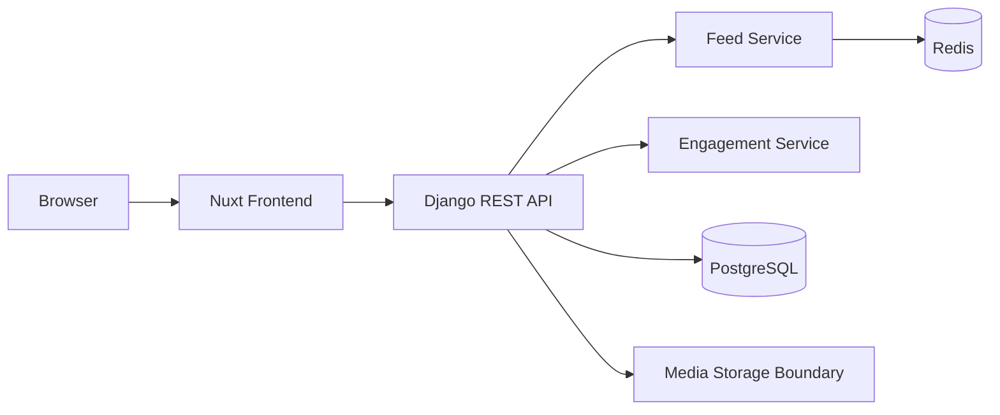
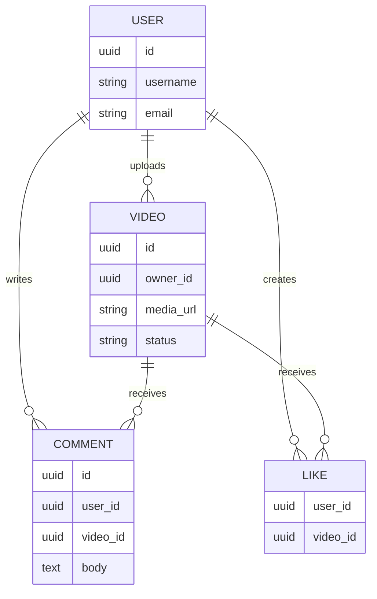
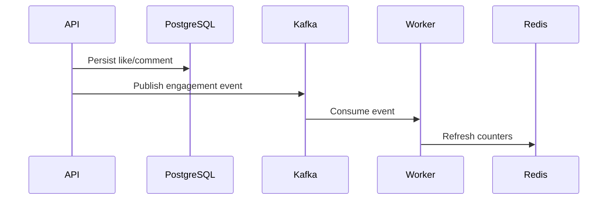
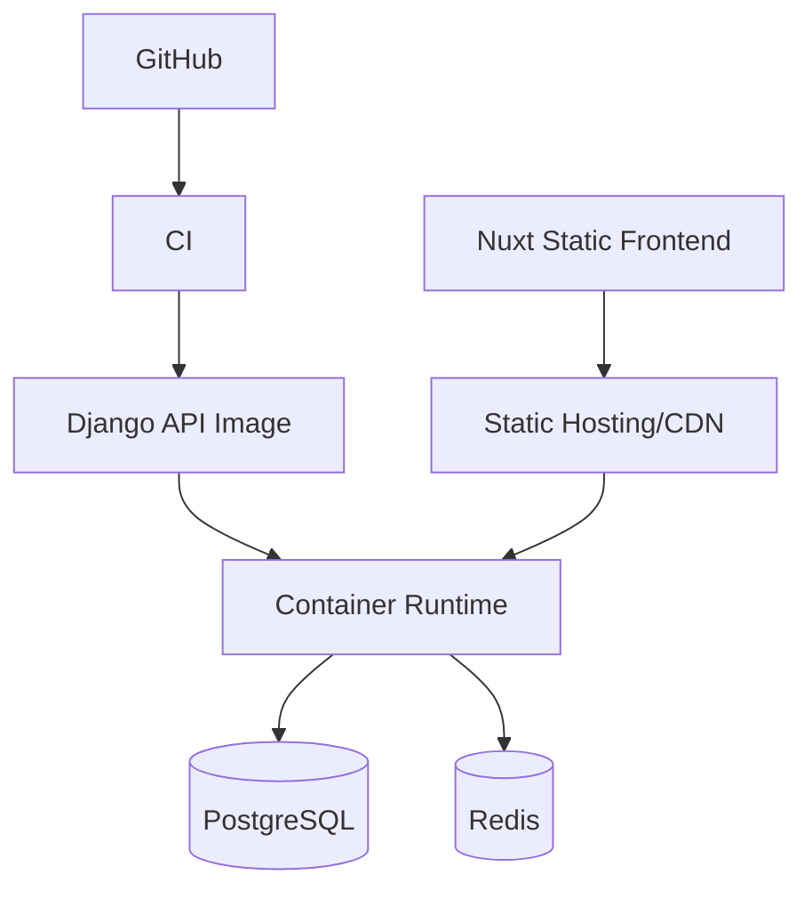

# Overview

TikTok Clone is a social video platform project focused on feed browsing, comments, likes, user profiles, and API-driven frontend integration.

The project is documented as a production-style system: the feed is treated as a read model, engagement actions are isolated as writes, and media storage is kept behind a clear boundary.

# Architecture



# Screenshots

Primary project visual: `/images/projects/tiktok.webp`.

Future screenshots should include the feed page, video detail page, creator profile, and mobile layout.

# API Design

```http
GET    /api/feed?cursor=...
GET    /api/videos/{video_id}
POST   /api/videos
POST   /api/videos/{video_id}/likes
DELETE /api/videos/{video_id}/likes
GET    /api/videos/{video_id}/comments
POST   /api/videos/{video_id}/comments
GET    /api/users/{username}
```

# Database Schema



# Caching

Redis stores feed slices and video counters.

- `feed:global:{cursor}`
- `feed:user:{user_id}:{cursor}`
- `video:stats:{video_id}`
- `profile:{username}`

Cache invalidation is event-driven around upload, delete, like, comment, and profile update workflows.

# Messaging

Engagement events can move through Kafka in the production version.



# Monitoring

Metrics:

- Feed p95 latency.
- Cache hit ratio.
- Like write conflicts.
- Comment creation failures.
- Database query duration.
- Redis memory usage.

# Deployment



# Performance

Targets:

- Cached feed p95 below 300 ms.
- Uncached feed p95 below 700 ms.
- Like/unlike p95 below 150 ms.
- Comment write p95 below 250 ms.
- First-page cache hit ratio above 80 percent.

# Lessons Learned

- Feed systems need explicit read-model design.
- Media bytes and metadata should not live in the same boundary.
- Redis works best when invalidation rules are tied to product events.
- Engagement write paths should be independently measurable.

# GitHub

Source code: [TikTok Clone](https://github.com/Rofikali/TikTokClone)

# Live Demo

The repository README is linked as the live technical preview for v0.1.
