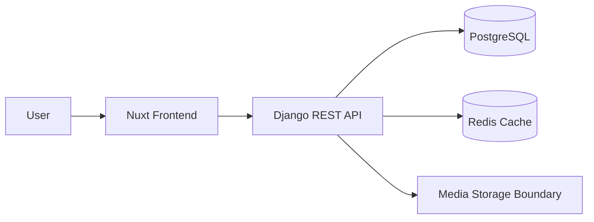

# Overview

TikTok Clone is a social video platform project focused on feed browsing, comments, likes, user profiles, and API-driven frontend integration.

The point of the project is not to copy a product surface. It is to reason through the backend and frontend architecture behind a media-heavy social workflow.

# Problem

Short-form video applications need fast feed access, user interaction workflows, and clear data boundaries. A naive implementation can couple comments, likes, video metadata, and feed ranking into one fragile model.

The engineering problem was to separate the interactive product features while keeping the first version simple enough to build and reason about.

# Solution

The solution uses a Nuxt frontend with a Django REST API. PostgreSQL stores durable application data, while Redis supports cacheable feed and interaction paths.

The system is designed so feed reads, comment writes, and like events can evolve independently.

# Architecture Diagram

# Tech Stack

- Nuxt and Vue for the frontend.
- Django REST Framework for API development.
- PostgreSQL for users, videos, comments, and likes.
- Redis for cacheable feed and interaction data.
- Docker for repeatable local development.

# API Design

Core API resources:

- Users
- Videos
- Feed
- Comments
- Likes

The feed should be a read-optimized endpoint, not a place where every social rule is hardcoded forever.

# Database

PostgreSQL stores identity, video metadata, comments, likes, and relationships. The schema should enforce ownership, timestamps, and referential integrity.

# Caching

Redis can cache feed slices and frequently requested metadata. Cache invalidation should be explicit around new uploads, deleted videos, likes, and comments.

# Deployment

The intended deployment model is Docker-based for the API and database services, with the Nuxt frontend generated or deployed separately depending on the hosting target.

# Monitoring

Useful metrics include feed latency, API error rate, comment creation failures, and cache hit ratio.

# Challenges

- Keeping feed reads fast without overbuilding recommendation infrastructure.
- Separating media concerns from relational metadata.
- Preventing like/comment workflows from becoming tightly coupled.
- Designing cache invalidation rules that match user behavior.

# Lessons Learned

- Feed systems need read-model thinking early.
- Media applications benefit from clear storage boundaries.
- Caching should support product behavior, not hide database design problems.
- A small social product still needs careful data ownership rules.

# GitHub

Source code: [TikTok Clone](https://github.com/Rofikali/tiktok-clone)

# Live Demo

The public demo target is planned. For v0.1, the repository README is linked as the live technical preview.
